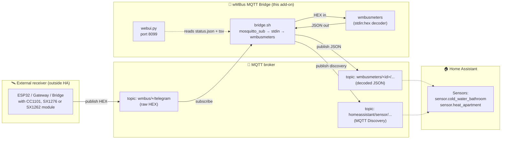
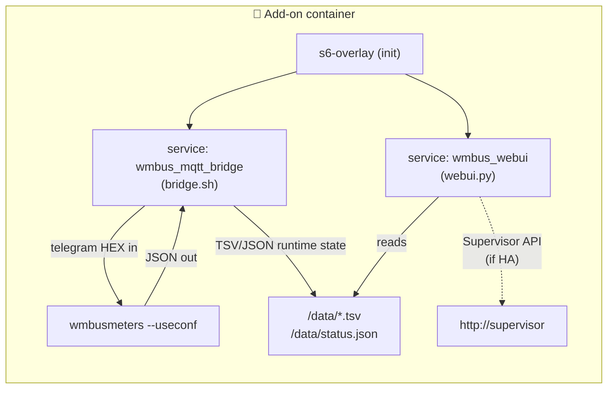
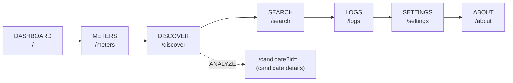
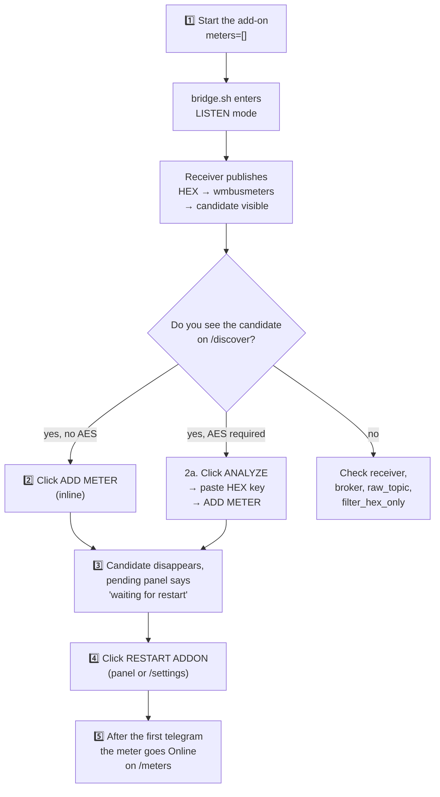
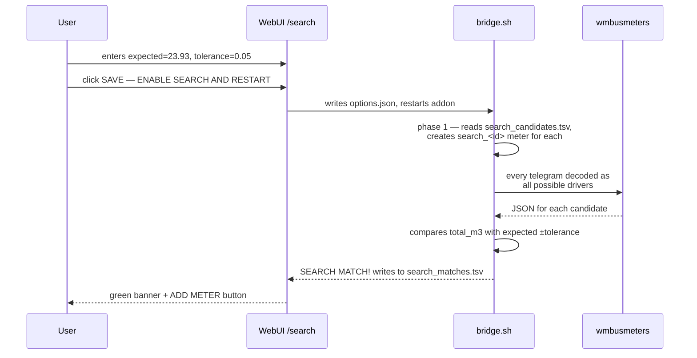
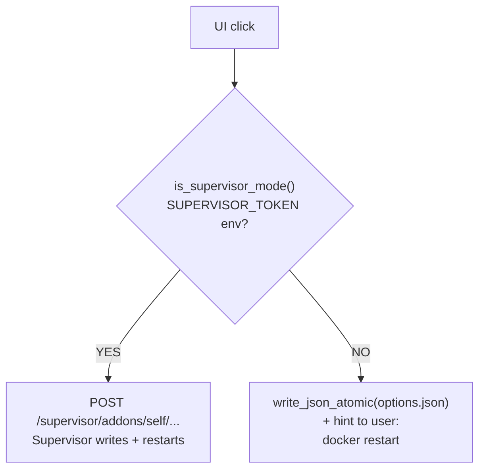
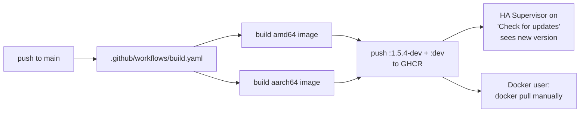

> 🌐 [**EN**](README.en.md) | [PL](README.pl.md) | [DE](README.de.md) | [CS](README.cs.md) | [SK](README.sk.md)

# wMBus MQTT Bridge — full documentation (EN)

> Document version: **1.5.4-dev**  ·  Language: **English**  ·  Status: dev-channel Home Assistant add-on
>
> A short bilingual overview lives in the main [README.md](../README.md). This document is the full English documentation — from "what is it" to architecture and runtime details.

---

## Table of contents

1. [TL;DR — what it does](#1-tldr--what-it-does)
2. [Data flow architecture](#2-data-flow-architecture)
3. [Quick start — Home Assistant](#3-quick-start--home-assistant)
4. [Quick start — Docker standalone](#4-quick-start--docker-standalone)
5. [WebUI — 7 views](#5-webui--7-views)
6. [Typical workflow: from empty to working meter](#6-typical-workflow-from-empty-to-working-meter)
7. [SEARCH mode — when LISTEN hears too many neighbours' meters](#7-search-mode--when-listen-hears-too-many-neighbours-meters)
8. [Complete configuration reference](#8-complete-configuration-reference)
9. [MQTT topics — what we publish, what we consume](#9-mqtt-topics--what-we-publish-what-we-consume)
10. [Runtime files in `/data/`](#10-runtime-files-in-data)
11. [Home Assistant vs Docker — UX differences](#11-home-assistant-vs-docker--ux-differences)
12. [UI localisation](#12-ui-localisation)
13. [Troubleshooting](#13-troubleshooting)
14. [Code architecture — for developers](#14-code-architecture--for-developers)
15. [Versioning and Docker images](#15-versioning-and-docker-images)
16. [Licence and upstream projects](#16-licence-and-upstream-projects)

---

## 1. TL;DR — what it does

> **In one sentence:** The add-on decodes Wireless M-Bus telegrams (water meters, heat meters, electricity meters) **without a local USB dongle** — the raw HEX telegrams are delivered to it by any external receiver (ESP32, bridge, gateway) over MQTT.

By default, `wmbusmeters` requires a radio dongle plugged into the host. This project solves it differently:

- **You** have a radio receiver far away from Home Assistant (e.g. an ESP32 in the attic with an antenna).
- **The receiver** publishes raw HEX frames to MQTT.
- **This add-on** subscribes to that broker, feeds `wmbusmeters` via `stdin:hex`, decodes JSON, and republishes the result back to MQTT + Home Assistant Discovery.

Result: **your meters appear as sensors in HA, with no radio hardware on the HA side.**

> 🤝 **Pairs with the ESPHome firmware** — This add-on is typically used together with [`esphome-wmbus-bridge-rawonly`](https://github.com/Kustonium/esphome-wmbus-bridge-rawonly), an ESPHome external component running on an ESP32 with a **CC1101, SX1276 or SX1262** radio. The ESP receives the radio frames and publishes raw HEX to MQTT; this add-on decodes them. The two projects are **independent** — this add-on accepts hex from any source publishing to the configured `raw_topic`.

---

## 2. Data flow architecture

### Data pipeline



### Component map inside the container



**Three processes running in parallel** managed by `s6-overlay`:

| Process | What it does | File |
|---|---|---|
| `bridge.sh` | Subscribes to MQTT, feeds wmbusmeters HEX, parses JSON, publishes results | [rootfs/usr/bin/bridge.sh](../rootfs/usr/bin/bridge.sh) |
| `wmbusmeters` | Telegram decoder (upstream binary — Fredrik Öhrström) | `/usr/bin/wmbusmeters` |
| `webui.py` | HTTP server on port 8099, management panel | [rootfs/usr/bin/webui.py](../rootfs/usr/bin/webui.py) |

The three components communicate only through **files in `/data/`** — no sockets inside the container. This means the webui can be restarted independently of the bridge, and state persists across restarts.

> 🔗 **On the receiver side (ESP32 with radio)** — we use Kustonium's sibling project: **[esphome-wmbus-bridge-rawonly-dev](https://github.com/Kustonium/esphome-wmbus-bridge-rawonly-dev)** — ESPHome firmware for SX1262 / SX1276 / CC1101 that publishes raw HEX to `wmbus/<device>/telegram`. The topic matches our default `raw_topic: wmbus/+/telegram` exactly — no configuration needed on our side. The receiver has its own full documentation (EN/PL) — start with [`START_HERE.md`](https://github.com/Kustonium/esphome-wmbus-bridge-rawonly-dev/blob/main/docs/START_HERE.md).

---

## 3. Quick start — Home Assistant

### Step 1 — add the repository

In HA: **Settings → Add-ons → Add-on Store → ⋮ (menu) → Repositories**, add:

```
https://github.com/Kustonium/homeassistant-wmbus-mqtt-bridge
```

### Step 2 — install the add-on

In the store, find **wMBus MQTT Bridge Dev** (the "dev" section), click **Install**.

> ⚠️ Do not install the official `wmbusmeters` add-on in parallel — this project bundles its own wmbusmeters instance and duplicates it.

### Step 3 — start with empty `meters` list (LISTEN mode)

Click **Start**. By default `meters: []` — the add-on enters LISTEN mode and only listens; nothing is configured yet.

### Step 4 — open the WebUI

In the add-on **Info** tab click **OPEN WEB UI**. You will be greeted by the dashboard:

```
┌────────────────────────────────────────────────────────────────┐
│ wMBus MQTT Bridge                              [EN PL DE CS SK]│
│ Dashboard | Meters | Discover | Search | Logs | Settings | ⋮  │
├────────────────────────────────────────────────────────────────┤
│ Dashboard                                                      │
│ Runtime pipeline status...                                     │
│                                                                │
│ [System status]  [Statistics]  [Discovery]                     │
│                                                                │
│ Configured meters                                              │
│   (empty)                                                      │
│                                                                │
│ Detected candidates                                            │
│   12 candidates / OPEN DISCOVER                                │
└────────────────────────────────────────────────────────────────┘
```

### Step 5 — go to "Discover" and add a meter

In the **DISCOVER** tab you'll see the list of candidates. For each one without an AES-key requirement — an **ADD METER** button right inline in the row. Click, restart, done.

➡️ Full description of this workflow in [§6 Typical workflow](#6-typical-workflow-from-empty-to-working-meter).

---

## 4. Quick start — Docker standalone

For everyone outside Home Assistant (DietPi, Ubuntu, Raspberry Pi OS, NAS, etc.).

### Requirements

- Docker + docker compose
- A working MQTT broker (Mosquitto, EMQX, …) reachable from the host
- A radio receiver publishing HEX frames to the broker — e.g. [esphome-wmbus-bridge-rawonly-dev](https://github.com/Kustonium/esphome-wmbus-bridge-rawonly-dev) (publishes to `wmbus/<device>/telegram`, compatible out-of-the-box)

### Installation

```bash
git clone https://github.com/Kustonium/homeassistant-wmbus-mqtt-bridge.git
mkdir -p /home/wmbus-test
cp -a homeassistant-wmbus-mqtt-bridge/docker/examples/* /home/wmbus-test/
cd /home/wmbus-test
docker compose up -d --build
docker compose logs -f wmbus
```

The first logs should show:

```
[wmbus-bridge] mqtt: connected to 192.168.1.10:1883
[wmbus-bridge] No meters configured -> LISTEN MODE
```

### Configuration

Edit `./config/options.json`. Full field reference in [§8](#8-complete-configuration-reference). Minimal example:

```json
{
  "raw_topic": "wmbus_bridge/+/telegram",
  "loglevel": "normal",
  "discovery_enabled": true,
  "state_prefix": "wmbusmeters",
  "mqtt_mode": "external",
  "external_mqtt_host": "192.168.1.10",
  "external_mqtt_port": 1883,
  "external_mqtt_username": "user",
  "external_mqtt_password": "pass",
  "meters": []
}
```

After editing:

```bash
docker compose restart wmbus
```

### WebUI under Docker

Expose port 8099 in `docker-compose.yml`:

```yaml
services:
  wmbus:
    ports:
      - "8099:8099"
```

Then open `http://<host-ip>:8099/`.

> 💡 In Docker mode the UI detects the missing `SUPERVISOR_TOKEN` and replaces RESTART buttons with a `docker restart <container>` hint — see [§11](#11-home-assistant-vs-docker--ux-differences).

---

## 5. WebUI — 7 views

The WebUI is available in **5 languages** (EN/PL/DE/CS/SK) — switcher in the top-right corner. Language is detected from (in order): `?lang=`, cookie `wmbus_lang`, `Accept-Language` header.

All pages auto-refresh every 15 seconds (except `/candidate`).

### Tab map



### 5.1. Dashboard (`/`)

Three top cards: **System status** (MQTT, RAW telegrams, wmbusmeters, decoded JSON, configured meters, HA Discovery), **Statistics** (counts + mini-bars), **Discovery status** (prefixes + number of meters/candidates).

Below: a compact grid of configured meters + a candidate summary with the "OPEN DISCOVER" button.

If you have **pending changes** (you added something before a restart) — a yellow panel appears here, on `/meters` and on `/discover`. See [§6](#step-3--see-whats-waiting-for-restart).

### 5.2. Meters (`/meters`)

Full grid of **decoded** meters. Each card:

```
┌──────────────────────────────┐
│ 💧 cold_water_bathroom       │
│ 41553221 / mkradio3          │
│                              │
│ total_m3                     │
│ 123.456                      │
│ ─────────────────────────    │
│ Media:    water              │
│ Reception: ~30 min           │
│ Seen 15m:  2  Seen 60m: 5    │
│ ─────────────────────────    │
│ [Online]            [DELETE] │
└──────────────────────────────┘
```

The main value is the **current** instantaneous value or the meter reading (since version 1.5.2-dev — see [§13](#13-troubleshooting)).

### 5.3. Discover (`/discover`)

Table of LISTEN-mode candidates. For each one you see: ID, driver, media (💧/⚡/🔥/📡), encryption (AES required / no AES / —), reception (15m/60m), last telegram, actions.

**Actions** depend on the encryption pill:

| Pill | Buttons |
|---|---|
| 🟢 **no AES** or grey **—** | `[ADD METER] [ANALYZE] [IGNORE]` — inline ADD, one click = writes to `options.json` |
| 🔴 **AES required** | `[ANALYZE] [IGNORE]` — you have to enter `/candidate` and paste a 32-character HEX key |

Media filters at the top: **All / Water / Electricity / Heat / Other**. The second link `[Ignored]` shows previously-ignored candidates (with RESTORE option).

### 5.4. Search (`/search`)

Service mode — used when LISTEN returns dozens of neighbours' meters (e.g. an apartment block) and you don't know which one is yours. See the dedicated section [§7](#7-search-mode--when-listen-hears-too-many-neighbours-meters).

The UI has 3 banners (contextual):

- 🟢 **MATCH FOUND** — when a match was found
- 🟢 **SEARCH MODE ACTIVE** — running, waiting for more telegrams
- 🟡 **SEARCH MODE — configuration** — before enabling

Plus a configuration form (m³ reading + tolerance) and live status from bridge.sh (KV: phase, cached, ignored, loaded, decoded, checked, matches, last candidate, last checked, last reason).

### 5.5. Logs (`/logs`)

Short runtime event stream from [`status_events.tsv`](#10-runtime-files-in-data) — RAW received, candidate detected, errors. Full logs are still in the HA add-on **Log** tab.

### 5.6. Settings (`/settings`)

Shows the active runtime config (from `status.json`):
- `raw_topic`, `state_prefix`, `discovery_prefix`
- `search_mode`, `search_expected_value_m3`, `search_tolerance_m3`
- `loglevel`, MQTT host, ignored candidates count

Plus a **RESTART ADDON** block (or in Docker mode: a `docker restart` hint) and a list of runtime files + a **MANAGE IGNORED CANDIDATES** button (redirects to `/discover?ignored=1`).

### 5.7. About (`/about`)

Short architecture description and ASCII diagram.

---

## 6. Typical workflow: from empty to working meter



### Step 1 — first run

`meters: []` in configuration. The add-on starts, connects to the broker, waits. In the logs:

```
[wmbus-bridge] mqtt: connected
[wmbus-bridge] No meters configured -> LISTEN MODE
[wmbus-bridge][INFO] === NEW METER CANDIDATE DETECTED ===
[wmbus-bridge][INFO] Received telegram from: 41553221
[wmbus-bridge][INFO] Suggested driver: mkradio3
```

WebUI → **Discover** shows 41553221 with driver `mkradio3`.

### Step 2 — add the candidate

For a meter without encryption: in the **DISCOVER** row click `ADD METER`. Under the hood:

1. POST `/add-meter` → `add_meter_to_options(meter_id, driver, "")` in `webui.py`
2. Check `SUPERVISOR_TOKEN`:
   - **Present** → POST to `http://supervisor/addons/self/options` with the whole `meters[]` array → Supervisor persists it
   - **Missing** → `write_json_atomic(/data/options.json, ...)` — direct file write
3. Redirect back to `/discover?added=...`

Result: the meter is in `options.json`, but **wmbusmeters still doesn't know about it** (it will only learn after a restart).

### Step 3 — see what's waiting for restart

The WebUI shows immediately that you have inactive changes:

**Yellow panel at the top of /discover, /meters and the dashboard:**

```
┌─────────────────────────────────────────────────────────────┐
│ ⚠ Pending changes — waiting for restart (2)                 │
│ These meters are in options.json but the add-on hasn't      │
│ picked them up yet. Restart the add-on to load them.        │
│ ┌─────────────────────────────────────────────┐             │
│ │ Meter ID   │ Driver       │ AES             │             │
│ │ 41553221   │ mkradio3     │ no AES key      │             │
│ │ aabbccdd   │ amiplus      │ AES key set     │             │
│ └─────────────────────────────────────────────┘             │
│                                                             │
│ [ RESTART ADDON NOW ]                                       │
└─────────────────────────────────────────────────────────────┘
```

Plus grey/dashed "pending" cards in the configured-meter grid showing "Pending / pending restart".

The mechanism works by comparing `options.json` ↔ `status_meters.tsv`. An entry disappears from pending automatically as soon as wmbusmeters decodes the first telegram for that ID.

### Step 4 — restart

In HA mode: click **RESTART ADDON NOW** → POST `/restart-bridge` → call to `http://supervisor/addons/self/restart`.

In Docker mode: instead of the button — the `docker restart <container>` instruction. See [§11](#11-home-assistant-vs-docker--ux-differences).

### Step 5 — done

After the restart wmbusmeters gets the new config, waits for the next telegram. When it arrives:

1. JSON lands in MQTT (`wmbusmeters/<id>/...`)
2. `bridge.sh` writes an entry to `status_meters.tsv`
3. WebUI at the next refresh (15s) shows the meter as **Online** instead of "Pending"
4. HA Discovery automatically creates entities `sensor.<id>_total_m3` etc.

---

## 7. SEARCH mode — when LISTEN hears too many neighbours' meters

In an apartment block your receiver catches 30-50 telegrams from neighbours. LISTEN shows 30 candidates. Which one is yours?

**SEARCH solves it by comparing the m³ reading from the physical meter's display** with the decodes of all candidates.

### Phases



### Configuration through the UI

Go to `/search`:

1. **Meter reading** — type the current value from the display, e.g. `23.93` or `23,93` (both accepted)
2. **Tolerance m³** — default `0.05` (50 litres). In an apartment block **do not use `0.5`** — many meters may have similar readings
3. Click **SAVE — ENABLE SEARCH AND RESTART**

The add-on will restart and enter SEARCH MODE. Wait for more telegrams (typical intervals: 30 s — 15 min depending on the meter).

### Result

When a match is found:

```
[wmbus-bridge][WARN] SEARCH MATCH: id=03534159 driver=hydrodigit
  media=water field=total_m3 value=23.932 m3
  expected=23.93 diff=0.002000 m3
[wmbus-bridge][WARN] SEARCH SUGGESTED CONFIG:
  {"id":"meter_03534159","meter_id":"03534159","type":"hydrodigit",
   "type_other":"","key":""}
```

WebUI on `/search` shows:

```
✅ SEARCH MODE — MATCH FOUND
Top-level result: match found (1)

┌──────────────────────────────────────────────────────┐
│ 03534159  hydrodigit · water                         │
│ value: 23.932 m³ · expected: 23.93 m³ · diff: 0.002  │
│ {"id":"meter_03534159","meter_id":"03534159",...}    │
│                                                      │
│ [ ADD METER ]  [ COPY CONFIG ]                       │
└──────────────────────────────────────────────────────┘
```

Click ADD METER → saved to `options.json`, restart, done.

### After you're done

- **Turn off `search_mode`** — returns to normal work with `meters[]`
- Temporary `search_*` meters do not create HA entities
- Files `/data/search_candidates.tsv` and `/data/search_matches.tsv` can be deleted so the next search starts with a clean slate

---

## 8. Complete configuration reference

From [`config.yaml`](../config.yaml):

### MQTT — input / output

| Field | Type | Default | Description |
|---|---|---|---|
| `raw_topic` | str | `wmbus/+/telegram` | Topic with raw HEX from the receiver. `+` is the MQTT wildcard — matches one segment |
| `filter_hex_only` | bool | `true` | Ignore MQTT messages that don't look like HEX (protects against garbage) |
| `mqtt_mode` | enum | `auto` | `auto` (HA broker if available, otherwise external), `ha` (force HA), `external` (always external) |
| `external_mqtt_host` | str? | `""` | External broker host (when `mqtt_mode=external`) |
| `external_mqtt_port` | int | `1883` | External broker port |
| `external_mqtt_username` | str? | `""` | Broker username |
| `external_mqtt_password` | str? | `""` | Broker password |

### Discovery and output

| Field | Type | Default | Description |
|---|---|---|---|
| `discovery_enabled` | bool | `true` | Publishes HA Discovery configuration |
| `discovery_prefix` | str | `homeassistant` | Standard HA Discovery prefix |
| `discovery_retain` | bool | `true` | Discovery messages as retained |
| `state_prefix` | str | `wmbusmeters` | Topic prefix for meter values |
| `state_retain` | bool | `false` | Retained for state (usually not wanted, HA pulls anyway) |

### SEARCH mode

| Field | Type | Default | Description |
|---|---|---|---|
| `search_mode` | bool | `false` | Enables SEARCH (see [§7](#7-search-mode--when-listen-hears-too-many-neighbours-meters)) |
| `search_expected_value_m3` | float | `0` | Expected m³ reading from the physical meter |
| `search_tolerance_m3` | float | `0.05` | Match tolerance — in an apartment block don't use >`0.05` |
| `search_delta_mode` | bool | `false` | (Experimental) Compares delta instead of absolute value |
| `search_min_delta_m3` | float | `0.001` | Delta threshold for `search_delta_mode` |
| `search_topic` | str | `wmbus/search/candidates` | Optional MQTT topic for search results |

### Debug

| Field | Type | Default | Description |
|---|---|---|---|
| `loglevel` | enum | `normal` | `normal` / `verbose` / `debug` — verbose logs every RAW received |
| `debug_every_n` | int | `0` | Log diagnostics every N-th telegram (0 = off) |

### Meters — `meters[]`

Each entry is an object:

| Field | Type | Required | Description |
|---|---|---|---|
| `id` | str | yes | Your label, used in the MQTT topic and the HA sensor name |
| `meter_id` | str | yes | 8-character HEX, meter serial number (from LISTEN) |
| `type` | enum | yes | wmbusmeters driver — full list of 100+ in [`config.yaml:75`](../config.yaml#L75) or `auto`/`other` |
| `type_other` | str? | only when `type=other` | Custom driver name |
| `key` | str? | only for encrypted meters | 32-character HEX, AES key |

Most common drivers for water and heat: `multical21`, `iperl`, `flowiq2200`, `mkradio3`, `mkradio4`, `kamwater`, `hydrodigit`, `hydrus`. Electricity: `amiplus`. Heat: `kamheat`, `hydrocalm3`, `qcaloric`.

---

## 9. MQTT topics — what we publish, what we consume

### We subscribe to (input)

```
<raw_topic>  →  e.g. wmbus/<receiver_id>/telegram
```

Payload: raw HEX from the wM-Bus telegram, ASCII. Every character `[0-9A-Fa-f]`, length typically 40-200 characters. The bridge filters out payloads that don't match HEX (when `filter_hex_only=true`).

Example publish from the receiver:

```bash
mosquitto_pub -h broker -t 'wmbus/esp32-attic/telegram' \
  -m '244D8C0682185601A06D7AE3000000020FFCB39D000000000B6E000000'
```

### We publish (output)

#### State (decoded values)

```
<state_prefix>/<id>/state
```

E.g. for a meter `id=cold_water_bathroom`:

```
wmbusmeters/cold_water_bathroom/state
  →  {"id":"cold_water_bathroom","name":"...","media":"water","total_m3":123.456,"flow_m3h":0.0,"timestamp":"2026-05-17T10:00:00+02:00"}
```

The entire decoded telegram is published as a JSON payload on a single state topic per meter; HA picks individual fields from it via `value_template` in Discovery.

#### Home Assistant Discovery

```
<discovery_prefix>/sensor/<id>_<field>/config
```

E.g.:

```
homeassistant/sensor/wmbus_cold_water_bathroom/total_m3/config
  →  {"name":"cold_water_bathroom total_m3",
      "state_topic":"wmbusmeters/cold_water_bathroom/state",
      "value_template":"{{ value_json.get('total_m3') | default(none) }}",
      "json_attributes_topic":"wmbusmeters/cold_water_bathroom/state",
      "expire_after":3600,
      "unit_of_measurement":"m³",
      "device_class":"water",
      "state_class":"total_increasing",
      "unique_id":"wmbus_cold_water_bathroom_total_m3",
      ...}
```

#### SEARCH (optional)

```
<search_topic>  →  e.g. wmbus/search/candidates
```

Candidates found in the LISTEN phase of SEARCH mode are published here.

---

## 10. Runtime files in `/data/`

All files shared between `bridge.sh` ↔ `webui.py` live in `/data/`:

| File | Format | Writer | Reader | Contents |
|---|---|---|---|---|
| `options.json` | JSON | Supervisor / `webui.py` (fallback) | `bridge.sh`, `webui.py` | Main add-on configuration |
| `status.json` | JSON | `bridge.sh` | `webui.py` | Pipeline state snapshot (MQTT connected, counts, config echo) |
| `status_meters.tsv` | TSV | `bridge.sh` | `webui.py` | Decoded meters — one row per meter_id |
| `status_candidates.tsv` | TSV | `bridge.sh` | `webui.py` | LISTEN candidates |
| `status_candidate_analysis.tsv` | TSV | `bridge.sh` | `webui.py` | Candidate encryption analysis |
| `status_events.tsv` | TSV | `bridge.sh`, `webui.py` | `webui.py` | Last 80 events (RAW received, errors, UI actions) |
| `status_seen.tsv` | TSV | `bridge.sh` | `bridge.sh` | Reception interval history (for seen_15m/seen_60m stats) |
| `status_ignored_candidates.tsv` | text | `webui.py` | `bridge.sh`, `webui.py` | List of IDs ignored by the user |
| `status_raw_count.txt` | int | `bridge.sh` | `bridge.sh` | Counter of all RAW telegrams in this session |
| `status_last_raw_seen.txt` | ISO time | `bridge.sh` | `bridge.sh`, `webui.py` | Timestamp of the last RAW |
| `status_recent_raw.tsv` | TSV | `bridge.sh` | (for debug) | Ring buffer of last N RAW HEX values |
| `search_candidates.tsv` | TSV | `bridge.sh` | `bridge.sh` | Water-meter candidates for SEARCH |
| `search_matches.tsv` | TSV | `bridge.sh` | `webui.py` | Matches found in SEARCH |
| `search_status.json` | JSON | `bridge.sh` | `webui.py` | Live SEARCH status (phase, counts) |

> ⚠️ Files in `/data/etc/` are **generated at startup** — do not edit manually.

These files survive container restart (mounted `/data` volume), but `options.json` in HA is overwritten from Supervisor's state — manual edits to the file will not survive a restart in HA mode.

---

## 11. Home Assistant vs Docker — UX differences

One codebase, two run modes. The UI detects the mode itself based on the `SUPERVISOR_TOKEN` env variable (HA injects it when `hassio_api: true`).

### What works identically

✅ The entire WebUI (Dashboard, Meters, Discover, Search, Logs, Settings, About)
✅ 5-language localisation
✅ Inline ADD in the candidates table (difference only in writing: API vs file)
✅ Pending panel
✅ Bridge.sh — decoding, MQTT, Discovery
✅ Selection of instantaneous values (current_power_kw instead of total_kwh)

### What differs

| Action | Home Assistant | Docker standalone |
|---|---|---|
| Adding a meter | POST `http://supervisor/addons/self/options` (persistent) | `write_json_atomic(/data/options.json)` (file) |
| Banner after add | "Click RESTART ADDON below…" | "Restart the container manually to apply." |
| Pending panel — restart button | `[RESTART ADDON NOW]` (POST `/restart-bridge`) | Hint: `docker restart <container>` |
| `/settings` — restart section | Button + supervisor_api_notice | Yellow card with hint |
| `/candidate` — RESTART ADDON | POST button | Hint |
| Pulling new image | HA Supervisor auto on "Update Available" | `docker pull ...` manually |
| Change persistence | Supervisor (Supervisor DB) | `/data` volume |

### Why

There is no Supervisor API in Docker. A call to `http://supervisor/addons/self/restart` would return an error. Instead of showing a broken button to the user, the UI detects the missing token and replaces it with a textual instruction.



---

## 12. UI localisation

The WebUI supports 5 languages:

| Code | Language | Coverage |
|---|---|---|
| `en` | English | 100% |
| `pl` | Polski | 100% |
| `de` | Deutsch | 100% |
| `cs` | Čeština | 100% |
| `sk` | Slovenčina | 100% |

### How the language is chosen

Hierarchy (first match wins):

1. **URL** — `?lang=pl` at the end of the address
2. **Cookie** — `wmbus_lang=pl` (set when clicking the switcher)
3. **Header** — `Accept-Language` from the browser (e.g. `pl-PL, en;q=0.9`)
4. **Default** — `en`

### How to switch

Top-right corner of every page:

```
[EN]  PL   DE   CS   SK
```

Active language highlighted. Click = sets the cookie and reloads the page.

### For developers

All translations live in a single file — [rootfs/usr/bin/i18n.py](../rootfs/usr/bin/i18n.py). 153 keys × 5 languages. Adding a new key:

1. Add to `I18N["en"]`, `I18N["pl"]`, … all 5 dictionaries
2. Use in `webui.py` as `tr(lang, "your_key")`

Translations are applied through direct `tr()` calls — the old `localize_html` mechanism (string replacement) is only a fallback.

---

## 13. Troubleshooting

### "I don't see any telegrams" (RAW count = 0)

Check in order:

1. **Is the receiver publishing to the right topic?**
   - Your config has `raw_topic: "wmbus/+/telegram"` — the receiver must publish to `wmbus/<anything>/telegram`
   - Manual test:
     ```bash
     mosquitto_sub -h <broker> -t 'wmbus/#' -v
     ```
2. **Is the bridge subscribed?** The logs should contain:
   ```
   [wmbus-bridge] mqtt: connected
   [wmbus-bridge] mqtt: subscribed to wmbus/+/telegram
   ```
3. **Is `filter_hex_only` not dropping them?** Enable `loglevel: verbose` and check if the logs say `dropped (not HEX)`. Your receiver may be sending base64 or JSON — in those cases disable the filter or change the format.
4. **Is the broker reachable?** `mqtt_mode=auto` tries HA first, then external. Check logs for connection errors.

### "Candidate added but the meter does not appear in Meters"

- Clicking **ADD METER** writes to `options.json` but **does not restart wmbusmeters**. You have to restart the add-on.
- The WebUI shows this through the **pending panel** (yellow, at the top of /discover, /meters, dashboard).
- After the restart wmbusmeters gets the new list, but it needs **another telegram** to decode it — this can take anywhere from a few dozen seconds to many minutes depending on the meter's interval.

### "The value shows a number that only grows, not an instantaneous one"

Since version **1.5.2-dev** the UI prefers instantaneous fields (`current_power_kw`, `volume_flow_m3h`, `_kw$`/`_w$`/`_m3h$`/`_l_h$`) over totals (`total_energy_consumption_kwh`).

For a water meter without `volume_flow_m3h` (e.g. mkradio3) — `total_m3` is the only sensible field and that's what's shown. It's the **meter reading** (as on the water meter's display), not cumulative consumption — although the number grows, it is current as of today.

The full pick logic is [in bridge.sh — `status_meter_seen`](../rootfs/usr/bin/bridge.sh).

### "HA doesn't show an add-on update"

HA Supervisor detects a new version only when `version:` in `config.yaml` changes. The image tag on GHCR is derived from `version:`. See [§15](#15-versioning-and-docker-images).

To force a check: **Settings → System → ⋮ → Reload** or `ha supervisor restart` from the HA host CLI.

### "I have an encrypted meter but I don't know where to get the AES key"

The AES key is provided by:
- **The meter supplier** (building administrator, water/heat supplier)
- **A sticker on the meter** (rarely)
- **Meter documentation** (if you have any)

Without the key you can't decode encrypted telegrams. Some meters use a so-called "zero-key" (`00000000000000000000000000000000`) as facade encryption — sometimes works.

### "Inline ADD did nothing" (under Docker)

Check:
- Is the `./config/` directory **writable** for the container user (not `:ro`)
- Is the log saying `Meter added to options.json (file only — no SUPERVISOR_TOKEN)` — that means the file was saved. Restart the container manually.
- Check the contents of `options.json` after clicking — it should contain a new entry in `meters[]`.

---

## 14. Code architecture — for developers

### Repository structure

```
.
├── config.yaml                  # HA add-on manifest: options, schema, image
├── Dockerfile                   # Multi-stage: builder + docker + addon
├── repository.yaml              # HA repo manifest
├── CHANGELOG.md
├── README.md
├── docs/                        # Full multi-language documentation
│   ├── README.en.md
│   ├── README.pl.md
│   ├── README.de.md
│   ├── README.cs.md
│   └── README.sk.md
├── docker/                      # Files for Docker standalone only
│   ├── entrypoint.sh
│   └── examples/                # docker-compose + example config/
├── rootfs/                      # Copied to / in the HA image
│   ├── etc/services.d/          # s6-overlay service definitions
│   │   ├── wmbus_mqtt_bridge/
│   │   └── wmbus_webui/
│   └── usr/bin/
│       ├── bridge.sh            # 1400+ lines — main loop, MQTT, decode
│       ├── i18n.py              # 5-language translations
│       ├── run.sh               # Startup wrapper for HA mode
│       └── webui.py             # 1700+ lines — HTTP server, pages, API
├── translations/                # HA add-on options translations (en.yaml, pl.yaml)
└── .github/workflows/           # CI: build-addon, shellcheck, yaml-lint
```

### Main components

#### `bridge.sh` (1400+ lines)

Bash, one process. Main loop:

1. **Setup** — read `options.json`, generate `wmbusmeters.conf` in `/data/etc/`
2. **MQTT subscribe** — `mosquitto_sub` on `raw_topic`, each line → `process_raw_telegram`
3. **HEX → wmbusmeters** — passed through `stdin:hex`
4. **JSON parse** — next line from `mosquitto_sub` on the wmbusmeters topic
5. **Status update** — write to `status_meters.tsv`, `status_events.tsv`, `status.json`
6. **HA Discovery publish** — MQTT Discovery messages computed for each new field
7. **SEARCH** — if enabled, decodes candidates from `search_candidates.tsv` in parallel

Key functions:
- `status_meter_seen()` ([line 316](../rootfs/usr/bin/bridge.sh#L316)) — writes an entry to `status_meters.tsv`, picks value_key (instantaneous > cumulative)
- `status_candidate_seen()` ([line 341](../rootfs/usr/bin/bridge.sh#L341)) — registers a LISTEN candidate
- `process_raw_telegram()` — main HEX → decode pipeline

#### `webui.py` (1700+ lines)

Python 3.12, `http.server.ThreadingHTTPServer`. No framework — raw HTTP + HTML strings. Main sections:

- **`state()`** ([line 583](../rootfs/usr/bin/webui.py#L583)) — reads all runtime files, returns a dict
- **`add_meter_to_options()`** ([line 385](../rootfs/usr/bin/webui.py#L385)) — Supervisor API + file fallback
- **`is_supervisor_mode()`** — detects HA vs Docker mode
- **`pending_meters()`** — diff `options.json` ↔ `status_meters.tsv`
- **`render_*()`** — functions rendering individual HTML fragments (system_status, stats, meter_card, candidates_table, …)
- **`page_*()`** — full-page renderers (`page_dashboard`, `page_meters`, `page_discover`, `page_search`, `page_candidate`, `page_logs`, `page_settings`, `page_about`)
- **`Handler` (BaseHTTPRequestHandler)** — GET/POST routing, language detection, cookie handling

Localisation (`i18n.py`):
- `tr(lang, key)` — main translation function
- `localize_html(html, lang)` — legacy string-replacement (fallback)
- `detect_lang(headers, params)` — URL → cookie → Accept-Language → default

#### `wmbusmeters` (upstream)

Binary compiled from [upstream](https://github.com/wmbusmeters/wmbusmeters) in the Dockerfile builder stage. Invoked with `stdin:hex` — reads HEX from stdin, decodes, publishes JSON to MQTT.

> ⚙️ A patch in the Dockerfile removes `-flto` from the Makefile because the current Alpine toolchain has issues with LTO.

### Local build

```bash
# HA image build (multi-arch):
docker buildx build \
  --build-arg BUILD_FROM=ghcr.io/home-assistant/amd64-base:3.20 \
  --target addon \
  -t wmbus-mqtt-bridge:local \
  .

# Docker standalone image build:
docker buildx build \
  --build-arg BUILD_FROM=ghcr.io/home-assistant/amd64-base:3.20 \
  --target docker \
  -t wmbus-bridge-docker:local \
  .
```

### Local webui.py tests

```bash
cd rootfs/usr/bin
WMBUS_BASE=/tmp/wmbus-test python webui.py
# Open http://localhost:8099/
```

With fake data (smoke test):

```python
import os, tempfile, json, pathlib
base = tempfile.mkdtemp()
os.environ['WMBUS_BASE'] = base
p = pathlib.Path(base)
p.joinpath('options.json').write_text(json.dumps({
    'meters': [{'id':'test','meter_id':'12345678','type':'multical21','key':''}]
}))
p.joinpath('status_meters.tsv').write_text('')
import webui
print(webui.render_page('/discover', {}, 'pl'))
```

---

## 15. Versioning and Docker images

### Versioning scheme

`MAJOR.MINOR.PATCH-dev` — semver with `-dev` suffix (developer channel).

| Part | Bumps when |
|---|---|
| MAJOR | Breaking change in configuration / MQTT / discovery |
| MINOR | New features (e.g. localisation, pending panel, inline ADD) |
| PATCH | Bug fixes, minor UX |
| `-dev` | While we're on the developer channel |

### GHCR image tags

Every build pushes 2 tags:

```
ghcr.io/kustonium/amd64-addon-wmbus_mqtt_bridge-dev:1.5.4-dev   ← version
ghcr.io/kustonium/amd64-addon-wmbus_mqtt_bridge-dev:dev          ← rolling latest
```

Plus the same for `aarch64-addon-...`. HA Supervisor uses the version tag (from `image` + `version` in `config.yaml`).

### CI/CD workflow



A version bump in `config.yaml` is **required** for HA to detect an update — without changing `version:` HA won't look at GHCR even if the image was rebuilt.

---

## 16. Licence and upstream projects

### Licence

**GNU General Public License v3.0 (GPL-3.0)**

This repository contains and modifies code from the `wmbusmeters-ha-addon` project (GPL-3.0). The entire project — including the fork, new components (webui.py, i18n.py, bridge.sh rewrite, pending panel, inline ADD) — is distributed under GPL-3.0.

### Upstream

- **wmbusmeters** — https://github.com/wmbusmeters/wmbusmeters (Fredrik Öhrström, GPL-3.0)
  - The wM-Bus telegram decoder, compiled from source in the Dockerfile
- **wmbusmeters-ha-addon** — https://github.com/wmbusmeters/wmbusmeters-ha-addon (GPL-3.0)
  - The original HA add-on the fork started from

### Attribution

The project is a fork developed by **Kustonium**. The main difference vs. upstream: MQTT input instead of a local dongle, WebUI in Polish/English/German/Czech/Slovak, full LISTEN → ADD → SEARCH workflow through the UI.

---

**End of documentation.** Questions, bugs, suggestions → [GitHub Issues](https://github.com/Kustonium/homeassistant-wmbus-mqtt-bridge/issues).

📚 Document prepared by Paige (BMad Method Technical Writer) for Foszt · 2026-05-17
