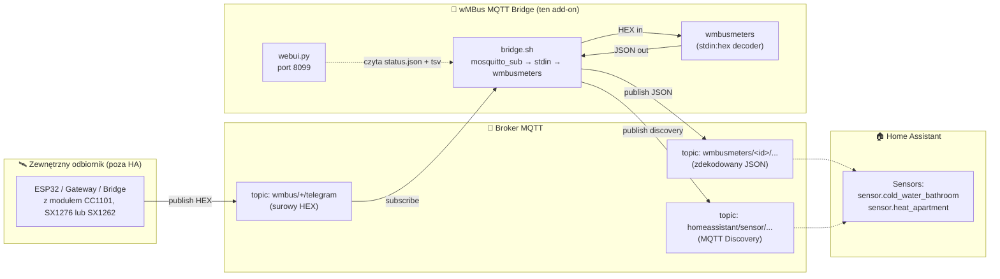
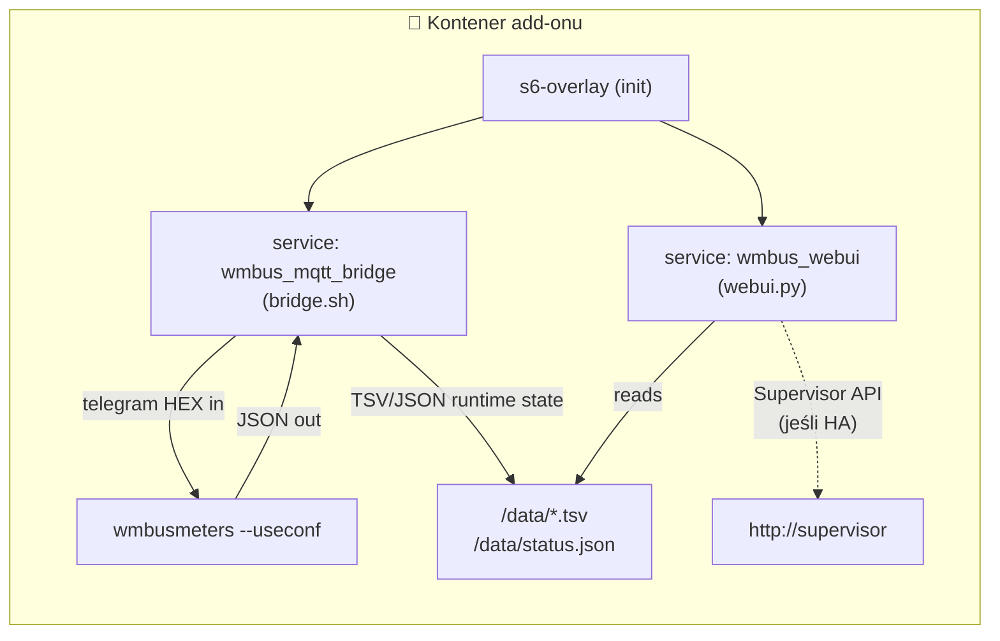
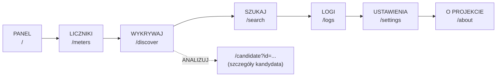
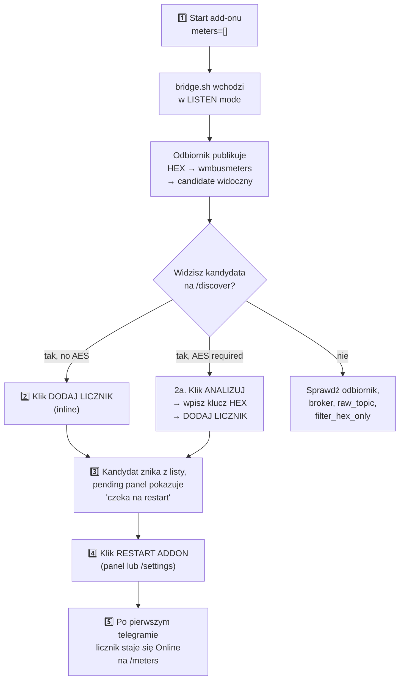
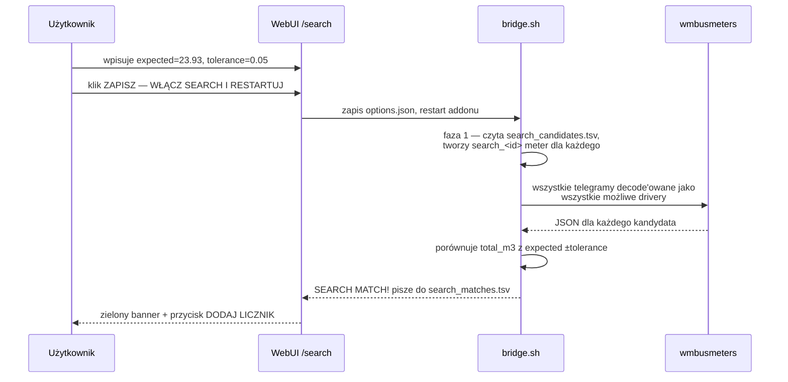
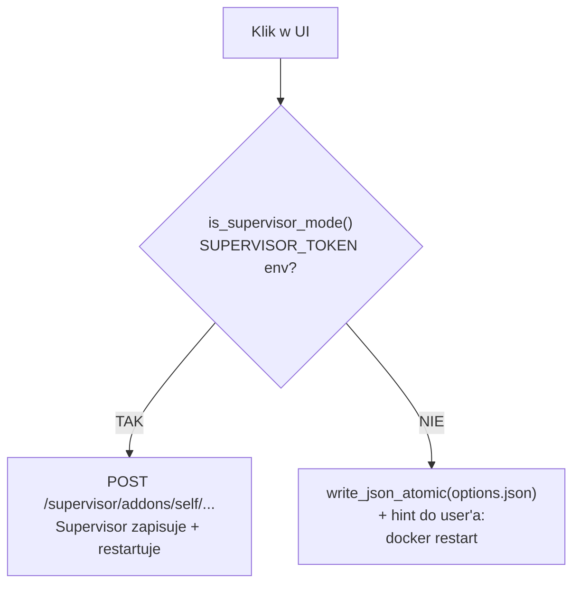
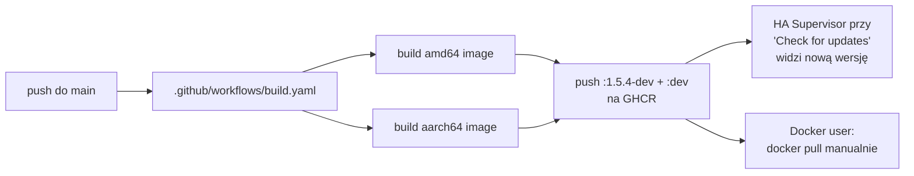

> 🌐 [EN](README.en.md) | [**PL**](README.pl.md) | [DE](README.de.md) | [CS](README.cs.md) | [SK](README.sk.md)

# wMBus MQTT Bridge — pełna dokumentacja PL

> Wersja dokumentu: **1.5.4-dev**  ·  Język: **polski**  ·  Status: dev-channel add-onu Home Assistant
>
> Skrócony, dwujęzyczny opis znajdziesz w głównym [README.md](../README.md). Ten dokument jest pełną, polską dokumentacją projektu — od „co to jest" po szczegóły architektury i runtime.

---

## Spis treści

1. [TL;DR — co to robi](#1-tldr--co-to-robi)
2. [Architektura przepływu danych](#2-architektura-przepływu-danych)
3. [Szybki start — Home Assistant](#3-szybki-start--home-assistant)
4. [Szybki start — Docker standalone](#4-szybki-start--docker-standalone)
5. [WebUI — 7 widoków po polsku](#5-webui--7-widoków-po-polsku)
6. [Typowy workflow: od pustki do działającego licznika](#6-typowy-workflow-od-pustki-do-działającego-licznika)
7. [Tryb SEARCH — gdy LISTEN słyszy za dużo cudzych liczników](#7-tryb-search--gdy-listen-słyszy-za-dużo-cudzych-liczników)
8. [Pełna lista opcji konfiguracji](#8-pełna-lista-opcji-konfiguracji)
9. [Tematy MQTT — co publikujemy, co konsumujemy](#9-tematy-mqtt--co-publikujemy-co-konsumujemy)
10. [Pliki runtime w `/data/`](#10-pliki-runtime-w-data)
11. [Home Assistant vs Docker — różnice UX](#11-home-assistant-vs-docker--różnice-ux)
12. [Lokalizacja interfejsu](#12-lokalizacja-interfejsu)
13. [Rozwiązywanie problemów](#13-rozwiązywanie-problemów)
14. [Architektura kodu — dla developerów](#14-architektura-kodu--dla-developerów)
15. [Wersjonowanie i obrazy Docker](#15-wersjonowanie-i-obrazy-docker)
16. [Licencja i projekty bazowe](#16-licencja-i-projekty-bazowe)

---

## 1. TL;DR — co to robi

> **W jednym zdaniu:** Add-on dekoduje telegramy Wireless M-Bus (wodomierze, liczniki ciepła, prądu) **bez lokalnego dongla USB** — telegramy w surowej formie HEX dostarcza Ci dowolny zewnętrzny odbiornik (ESP32, bridge, gateway) przez MQTT.

Standardowo `wmbusmeters` wymaga radio dongla podłączonego do hosta. Ten projekt rozwiązuje to inaczej:

- **Ty** masz odbiornik radiowy daleko od Home Assistant (np. ESP32 na strychu z anteną).
- **Odbiornik** publikuje surowe ramki HEX do MQTT.
- **Ten add-on** podpina się do tego brokera, dokarmia `wmbusmeters` przez `stdin:hex`, dekoduje JSON i publikuje wynik z powrotem do MQTT + Home Assistant Discovery.

Efekt: **Twoje liczniki pojawiają się jako sensory w HA, bez żadnego sprzętu radiowego po stronie HA.**

> 🤝 **Współpraca z firmware ESPHome** — Add-on jest typowo używany razem z [`esphome-wmbus-bridge-rawonly`](https://github.com/Kustonium/esphome-wmbus-bridge-rawonly), zewnętrznym komponentem ESPHome działającym na ESP32 z układem radiowym **CC1101, SX1276 lub SX1262**. ESP odbiera fale radiowe, publikuje surowe ramki HEX do MQTT, a ten add-on je dekoduje. Oba projekty są **niezależne** — add-on przyjmuje hex z dowolnego źródła publikującego na skonfigurowany `raw_topic`.

---

## 2. Architektura przepływu danych

### Pipeline danych



### Mapa komponentów wewnątrz kontenera



**Trzy procesy uruchomione równolegle** zarządzane przez `s6-overlay`:

| Proces | Co robi | Plik |
|---|---|---|
| `bridge.sh` | Subskrybuje MQTT, dokarmia wmbusmeters HEX-em, parsuje JSON, publikuje wyniki | [rootfs/usr/bin/bridge.sh](../rootfs/usr/bin/bridge.sh) |
| `wmbusmeters` | Dekoder telegramów (binarka, upstream — Fredrik Öhrström) | `/usr/bin/wmbusmeters` |
| `webui.py` | Serwer HTTP na porcie 8099, panel zarządzania | [rootfs/usr/bin/webui.py](../rootfs/usr/bin/webui.py) |

Te trzy komponenty komunikują się tylko przez **pliki w `/data/`** — żadnych socketów wewnątrz kontenera. Dzięki temu webui może być restartowane niezależnie od bridge'a, a stan jest perystentny przez restarty.

> 🔗 **Po stronie odbiornika (ESP32 z radiem)** — używamy siostrzanego projektu Kustoniem: **[esphome-wmbus-bridge-rawonly-dev](https://github.com/Kustonium/esphome-wmbus-bridge-rawonly-dev)** — firmware ESPHome dla SX1262 / SX1276 / CC1101 publikujący RAW HEX na `wmbus/<device>/telegram`. Topic dokładnie matchuje nasz domyślny `raw_topic: wmbus/+/telegram` — z naszej strony nic nie trzeba konfigurować. Receiver ma własną pełną dokumentację (EN/PL) — zacznij od [`START_HERE_PL.md`](https://github.com/Kustonium/esphome-wmbus-bridge-rawonly-dev/blob/main/docs/START_HERE_PL.md).

---

## 3. Szybki start — Home Assistant

### Krok 1 — dodaj repozytorium

W HA: **Settings → Add-ons → Add-on Store → ⋮ (menu) → Repositories**, dodaj:

```
https://github.com/Kustonium/homeassistant-wmbus-mqtt-bridge
```

### Krok 2 — zainstaluj add-on

W store znajdź **wMBus MQTT Bridge Dev** (sekcja „dev"), kliknij **Install**.

> ⚠️ Nie instaluj oficjalnego add-onu `wmbusmeters` równolegle — ten projekt ma własną instancję wmbusmeters i je dubluje.

### Krok 3 — uruchom z pustą listą `meters` (tryb LISTEN)

Kliknij **Start**. Domyślnie `meters: []` — add-on wchodzi w tryb LISTEN i tylko nasłuchuje, niczego jeszcze nie konfiguruje.

### Krok 4 — otwórz WebUI

W zakładce **Info** add-onu kliknij **OPEN WEB UI**. Powita Cię dashboard:

```
┌────────────────────────────────────────────────────────────────┐
│ wMBus MQTT Bridge                              [EN PL DE CS SK]│
│ Panel | Liczniki | Wykrywaj | Szukaj | Logi | Ustawienia | ⋮  │
├────────────────────────────────────────────────────────────────┤
│ Panel                                                          │
│ Status pipeline w czasie rzeczywistym...                       │
│                                                                │
│ [System status]  [Statistics]  [Discovery]                     │
│                                                                │
│ Skonfigurowane liczniki                                        │
│   (puste)                                                      │
│                                                                │
│ Wykryci kandydaci                                              │
│   12 kandydatów / OTWÓRZ WYKRYWANIE                            │
└────────────────────────────────────────────────────────────────┘
```

### Krok 5 — przejdź do „Wykrywaj" i dodaj licznik

W zakładce **WYKRYWAJ** zobaczysz listę kandydatów. Dla każdego bez wymagania klucza AES — przycisk **DODAJ LICZNIK** wprost w wierszu. Klik, restart, gotowe.

➡️ Pełny opis tego workflow w [§6 Typowy workflow](#6-typowy-workflow-od-pustki-do-działającego-licznika).

---

## 4. Szybki start — Docker standalone

Dla wszystkich poza Home Assistant (DietPi, Ubuntu, Raspberry Pi OS, NAS itp.).

### Wymagania

- Docker + docker compose
- Działający broker MQTT (Mosquitto, EMQX, …) dostępny z hosta
- Odbiornik radiowy publikujący ramki HEX do brokera — np. [esphome-wmbus-bridge-rawonly-dev](https://github.com/Kustonium/esphome-wmbus-bridge-rawonly-dev) (publikuje na `wmbus/<device>/telegram`, kompatybilne out-of-the-box)

### Instalacja

```bash
git clone https://github.com/Kustonium/homeassistant-wmbus-mqtt-bridge.git
mkdir -p /home/wmbus-test
cp -a homeassistant-wmbus-mqtt-bridge/docker/examples/* /home/wmbus-test/
cd /home/wmbus-test
docker compose up -d --build
docker compose logs -f wmbus
```

Pierwsze logi powinny pokazać:

```
[wmbus-bridge] mqtt: connected to 192.168.1.10:1883
[wmbus-bridge] No meters configured -> LISTEN MODE
```

### Konfiguracja

Edytuj `./config/options.json`. Pełna referencja pól w [§8](#8-pełna-lista-opcji-konfiguracji). Przykład minimalny:

```json
{
  "raw_topic": "wmbus_bridge/+/telegram",
  "loglevel": "normal",
  "discovery_enabled": true,
  "state_prefix": "wmbusmeters",
  "mqtt_mode": "external",
  "external_mqtt_host": "192.168.1.10",
  "external_mqtt_port": 1883,
  "external_mqtt_username": "user",
  "external_mqtt_password": "pass",
  "meters": []
}
```

Po edycji:

```bash
docker compose restart wmbus
```

### WebUI w Dockerze

Wystaw port 8099 w `docker-compose.yml`:

```yaml
services:
  wmbus:
    ports:
      - "8099:8099"
```

Następnie otwórz `http://<host-ip>:8099/`.

> 💡 W trybie Docker UI wykrywa brak `SUPERVISOR_TOKEN` i zamiast przycisków RESTART pokazuje wskazówkę `docker restart <container>` — patrz [§11](#11-home-assistant-vs-docker--różnice-ux).

---

## 5. WebUI — 7 widoków po polsku

WebUI jest dostępny w **5 językach** (EN/PL/DE/CS/SK) — przełącznik w prawym górnym rogu. Język wykrywany jest z (w kolejności): `?lang=`, cookie `wmbus_lang`, nagłówek `Accept-Language`.

Wszystkie strony auto-odświeżają się co 15 sekund (oprócz `/candidate`).

### Mapa zakładek



### 5.1. Panel (`/`) — dashboard

Trzy karty na górze: **System status** (MQTT, RAW telegrams, wmbusmeters, decoded JSON, configured meters, HA Discovery), **Statistics** (liczby + mini-bary), **Discovery status** (prefiksy + liczba liczników/kandydatów).

Poniżej: skrócona siatka skonfigurowanych liczników + podsumowanie kandydatów z przyciskiem „OTWÓRZ WYKRYWANIE".

Jeśli masz **pending changes** (dodałeś coś przed restartem) — żółty panel pojawia się tutaj, na `/meters` i na `/discover`. Patrz [§6](#krok-3--zobacz-co-czeka-na-restart).

### 5.2. Liczniki (`/meters`)

Pełna siatka **zdekodowanych** liczników. Każda karta:

```
┌──────────────────────────────┐
│ 💧 woda_zimna_lazienka       │
│ 41553221 / mkradio3          │
│                              │
│ total_m3                     │
│ 123.456                      │
│ ─────────────────────────    │
│ Media:    water              │
│ Reception: ~30 min           │
│ Seen 15m:  2  Seen 60m: 5    │
│ ─────────────────────────    │
│ [Online]            [DELETE] │
└──────────────────────────────┘
```

Wartość główna to **aktualna** wartość chwilowa lub stan licznika (od wersji 1.5.2-dev — patrz [§13](#13-rozwiązywanie-problemów)).

### 5.3. Wykrywaj (`/discover`)

Tabela kandydatów z LISTEN mode. Dla każdego widoczne: ID, driver, media (💧/⚡/🔥/📡), szyfrowanie (AES required / no AES / —), odbiór (15m/60m), ostatni telegram, akcje.

**Akcje** zależą od pillu szyfrowania:

| Pill | Przyciski |
|---|---|
| 🟢 **no AES** lub szare **—** | `[DODAJ LICZNIK] [ANALIZUJ] [IGNORUJ]` — inline ADD, jeden klik = zapisuje do `options.json` |
| 🔴 **AES required** | `[ANALIZUJ] [IGNORUJ]` — musisz wejść w `/candidate` i wpisać 32-znakowy klucz HEX |

Filtry mediów na górze: **Wszystkie / Woda / Prąd / Ciepło / Inne**. Drugi link `[Ignorowani]` pokazuje wcześniej zignorowanych kandydatów (z opcją PRZYWRÓĆ).

### 5.4. Szukaj (`/search`)

Tryb serwisowy — używany gdy LISTEN zwraca dziesiątki cudzych liczników (np. blok mieszkalny) i nie wiesz który jest Twój. Patrz dedykowana sekcja [§7](#7-tryb-search--gdy-listen-słyszy-za-dużo-cudzych-liczników).

UI ma 3 banery (kontekstowe):

- 🟢 **MATCH FOUND** — gdy znaleziono dopasowanie
- 🟢 **SEARCH MODE ACTIVE** — kiedy działa, czeka na kolejne telegramy
- 🟡 **SEARCH MODE — konfiguracja** — przed włączeniem

Plus formularz konfiguracji (wskazanie m³ + tolerancja) i live status z bridge.sh (KV: phase, cached, ignored, loaded, decoded, checked, matches, last candidate, last checked, last reason).

### 5.5. Logi (`/logs`)

Krótki strumień zdarzeń runtime z [`status_events.tsv`](#10-pliki-runtime-w-data) — RAW received, candidate detected, errors. Pełne logi i tak są w zakładce **Log** add-onu HA.

### 5.6. Ustawienia (`/settings`)

Pokazuje aktywną konfigurację runtime (z `status.json`):
- `raw_topic`, `state_prefix`, `discovery_prefix`
- `search_mode`, `search_expected_value_m3`, `search_tolerance_m3`
- `loglevel`, MQTT host, ignored candidates count

Plus blok **RESTART ADDON** (lub w trybie Docker: hint `docker restart`) i lista plików runtime + przycisk **MANAGE IGNORED CANDIDATES** (przekierowanie na `/discover?ignored=1`).

### 5.7. O projekcie (`/about`)

Krótki opis architektury i diagram ASCII.

---

## 6. Typowy workflow: od pustki do działającego licznika



### Krok 1 — pierwsze uruchomienie

`meters: []` w konfiguracji. Add-on startuje, łączy się z brokerem, czeka. W logach:

```
[wmbus-bridge] mqtt: connected
[wmbus-bridge] No meters configured -> LISTEN MODE
[wmbus-bridge][INFO] === NEW METER CANDIDATE DETECTED ===
[wmbus-bridge][INFO] Received telegram from: 41553221
[wmbus-bridge][INFO] Suggested driver: mkradio3
```

WebUI → **Wykrywaj** pokazuje 41553221 z drivera `mkradio3`.

### Krok 2 — dodaj kandydata

Dla licznika bez szyfrowania: w wierszu **WYKRYWAJ** klik `DODAJ LICZNIK`. Pod spodem:

1. POST `/add-meter` → `add_meter_to_options(meter_id, driver, "")` w `webui.py`
2. Sprawdzenie `SUPERVISOR_TOKEN`:
   - **Jest** → POST do `http://supervisor/addons/self/options` z całą tablicą `meters[]` → Supervisor zapisuje persistently
   - **Nie ma** → `write_json_atomic(/data/options.json, ...)` — bezpośredni zapis pliku
3. Redirect z powrotem na `/discover?added=...`

Wynik: licznik jest w `options.json`, ale **wmbusmeters jeszcze go nie zna** (uczyta dopiero po restarcie).

### Krok 3 — zobacz „co czeka na restart"

WebUI od razu pokazuje, że masz nieaktywne zmiany:

**Żółty panel na górze /discover, /meters i dashboardu:**

```
┌─────────────────────────────────────────────────────────────┐
│ ⚠ Oczekujące zmiany — czekają na restart (2)                │
│ Te liczniki są w options.json, ale add-on jeszcze ich       │
│ nie odebrał. Zrestartuj add-on aby je załadować.            │
│ ┌─────────────────────────────────────────────┐             │
│ │ Meter ID   │ Driver       │ AES             │             │
│ │ 41553221   │ mkradio3     │ bez klucza AES  │             │
│ │ aabbccdd   │ amiplus      │ klucz ustawiony │             │
│ └─────────────────────────────────────────────┘             │
│                                                             │
│ [ ZRESTARTUJ ADDON TERAZ ]                                  │
└─────────────────────────────────────────────────────────────┘
```

Plus szare/przerywane karty „pending" w siatce skonfigurowanych liczników z napisem „Czeka / czeka na restart".

Mechanizm działa porównując `options.json` ↔ `status_meters.tsv`. Wpis znika z pending automatycznie, gdy wmbusmeters zdekoduje pierwszy telegram dla tego ID.

### Krok 4 — restart

W trybie HA: klik **ZRESTARTUJ ADDON TERAZ** → POST `/restart-bridge` → wywołanie `http://supervisor/addons/self/restart`.

W trybie Docker: zamiast przycisku — instrukcja `docker restart <container>`. Patrz [§11](#11-home-assistant-vs-docker--różnice-ux).

### Krok 5 — gotowe

Po restarcie wmbusmeters dostaje nową konfigurację, czeka na kolejny telegram. Gdy ten przyjdzie:

1. JSON ląduje w MQTT (`wmbusmeters/<id>/...`)
2. `bridge.sh` zapisuje wpis do `status_meters.tsv`
3. WebUI przy następnym odświeżeniu (15s) pokazuje licznik jako **Online** zamiast „Pending"
4. HA Discovery automatycznie tworzy encje `sensor.<id>_total_m3` itp.

---

## 7. Tryb SEARCH — gdy LISTEN słyszy za dużo cudzych liczników

W bloku mieszkalnym Twój odbiornik łapie 30-50 telegramów od sąsiadów. LISTEN pokaże 30 kandydatów. Który jest Twój?

**SEARCH rozwiązuje to porównując wskazanie m³ z wyświetlacza fizycznego licznika** z dekodami wszystkich kandydatów.

### Etapy działania



### Konfiguracja przez UI

Wejdź na `/search`:

1. **Wskazanie licznika** — wpisz aktualny stan z wyświetlacza, np. `23.93` lub `23,93` (oba akceptowane)
2. **Tolerancja m³** — domyślnie `0.05` (50 litrów). W bloku **nie używaj `0.5`** — wiele liczników może mieć podobny stan
3. Klik **ZAPISZ — WŁĄCZ SEARCH I RESTARTUJ**

Add-on zrestartuje się i wejdzie w SEARCH MODE. Czekaj na kolejne telegramy (typowe interwały: 30 s — 15 min w zależności od licznika).

### Wynik

Gdy znajdzie dopasowanie:

```
[wmbus-bridge][WARN] SEARCH MATCH: id=03534159 driver=hydrodigit
  media=water field=total_m3 value=23.932 m3
  expected=23.93 diff=0.002000 m3
[wmbus-bridge][WARN] SEARCH SUGGESTED CONFIG:
  {"id":"meter_03534159","meter_id":"03534159","type":"hydrodigit",
   "type_other":"","key":""}
```

WebUI na `/search` pokazuje:

```
✅ SEARCH MODE — ZNALEZIONO DOPASOWANIE
Wynik nadrzędny: znaleziono dopasowanie (1)

┌──────────────────────────────────────────────────────┐
│ 03534159  hydrodigit · water                         │
│ value: 23.932 m³ · expected: 23.93 m³ · diff: 0.002  │
│ {"id":"meter_03534159","meter_id":"03534159",...}    │
│                                                      │
│ [ DODAJ LICZNIK ]  [ KOPIUJ KONFIG ]                 │
└──────────────────────────────────────────────────────┘
```

Klik DODAJ LICZNIK → zapisane do `options.json`, restart, gotowe.

### Po zakończeniu

- **Wyłącz `search_mode`** — wraca do normalnej pracy z `meters[]`
- Tymczasowe `search_*` liczniki nie tworzą encji w HA
- Pliki `/data/search_candidates.tsv` i `/data/search_matches.tsv` można usunąć, żeby kolejne wyszukiwanie startowało z czystym stanem

---

## 8. Pełna lista opcji konfiguracji

Z [`config.yaml`](../config.yaml):

### MQTT — wejście / wyjście

| Pole | Typ | Domyślnie | Opis |
|---|---|---|---|
| `raw_topic` | str | `wmbus/+/telegram` | Topic z surowymi HEX-ami od odbiornika. `+` to wildcard MQTT — pasuje do jednego segmentu |
| `filter_hex_only` | bool | `true` | Ignoruj wiadomości MQTT które nie wyglądają jak HEX (chroni przed śmieciami) |
| `mqtt_mode` | enum | `auto` | `auto` (HA broker jeśli jest, inaczej external), `ha` (wymuś HA), `external` (zawsze zewnętrzny) |
| `external_mqtt_host` | str? | `""` | Host brokera zewnętrznego (gdy `mqtt_mode=external`) |
| `external_mqtt_port` | int | `1883` | Port brokera zewnętrznego |
| `external_mqtt_username` | str? | `""` | Login do brokera |
| `external_mqtt_password` | str? | `""` | Hasło do brokera |

### Discovery i wyjście

| Pole | Typ | Domyślnie | Opis |
|---|---|---|---|
| `discovery_enabled` | bool | `true` | Publikuje konfigurację HA Discovery |
| `discovery_prefix` | str | `homeassistant` | Standardowy prefix HA Discovery |
| `discovery_retain` | bool | `true` | Wiadomości discovery jako retained |
| `state_prefix` | str | `wmbusmeters` | Prefix tematu z wartościami liczników |
| `state_retain` | bool | `false` | Retained dla stanu (zwykle nie chcesz, bo HA i tak pobiera) |

### Tryb SEARCH

| Pole | Typ | Domyślnie | Opis |
|---|---|---|---|
| `search_mode` | bool | `false` | Włącza SEARCH (patrz [§7](#7-tryb-search--gdy-listen-słyszy-za-dużo-cudzych-liczników)) |
| `search_expected_value_m3` | float | `0` | Oczekiwane wskazanie m³ z fizycznego licznika |
| `search_tolerance_m3` | float | `0.05` | Tolerancja porównania — w bloku nie używaj >`0.05` |
| `search_delta_mode` | bool | `false` | (Eksperymentalne) Porównuje deltę zamiast wartości absolutnej |
| `search_min_delta_m3` | float | `0.001` | Próg delty w `search_delta_mode` |
| `search_topic` | str | `wmbus/search/candidates` | Opcjonalny topic MQTT dla wyników search |

### Debug

| Pole | Typ | Domyślnie | Opis |
|---|---|---|---|
| `loglevel` | enum | `normal` | `normal` / `verbose` / `debug` — verbose loguje każdy odebrany RAW |
| `debug_every_n` | int | `0` | Co N-ty telegram dodatkowo loguj diagnostykę (0 = wyłącz) |

### Liczniki — `meters[]`

Każdy wpis to obiekt:

| Pole | Typ | Wymagane | Opis |
|---|---|---|---|
| `id` | str | tak | Twoja etykieta, używana w temacie MQTT i nazwie sensora HA |
| `meter_id` | str | tak | 8-znakowy HEX, numer seryjny licznika (z LISTEN) |
| `type` | enum | tak | Driver wmbusmeters — pełna lista 100+ w [`config.yaml:75`](../config.yaml#L75) lub `auto`/`other` |
| `type_other` | str? | tylko gdy `type=other` | Niestandardowa nazwa drivera |
| `key` | str? | tylko dla szyfrowanych | 32-znakowy HEX, klucz AES |

Najczęstsze drivery do wody i ciepła: `multical21`, `iperl`, `flowiq2200`, `mkradio3`, `mkradio4`, `kamwater`, `hydrodigit`, `hydrus`. Prąd: `amiplus`. Ciepło: `kamheat`, `hydrocalm3`, `qcaloric`.

---

## 9. Tematy MQTT — co publikujemy, co konsumujemy

### Subskrybujemy (input)

```
<raw_topic>  →  np. wmbus/<receiver_id>/telegram
```

Payload: surowy HEX z telegramu wM-Bus, ASCII. Każdy znak `[0-9A-Fa-f]`, długość zwykle 40-200 znaków. Bridge filtruje payloady niepasujące do HEX (gdy `filter_hex_only=true`).

Przykład publikacji od odbiornika:

```bash
mosquitto_pub -h broker -t 'wmbus/esp32-strych/telegram' \
  -m '244D8C0682185601A06D7AE3000000020FFCB39D000000000B6E000000'
```

### Publikujemy (output)

#### State (zdekodowane wartości)

```
<state_prefix>/<id>/state
```

Np. dla licznika `id=woda_zimna_lazienka`:

```
wmbusmeters/woda_zimna_lazienka/state
  →  {"id":"woda_zimna_lazienka","name":"...","media":"water","total_m3":123.456,"flow_m3h":0.0,"timestamp":"2026-05-17T10:00:00+02:00"}
```

Cały zdekodowany telegram jest publikowany jako payload JSON na jednym temacie state na licznik; HA wybiera poszczególne pola z niego przez `value_template` w Discovery.

#### Home Assistant Discovery

```
<discovery_prefix>/sensor/<id>_<field>/config
```

Np.:

```
homeassistant/sensor/wmbus_woda_zimna_lazienka/total_m3/config
  →  {"name":"woda_zimna_lazienka total_m3",
      "state_topic":"wmbusmeters/woda_zimna_lazienka/state",
      "value_template":"{{ value_json.get('total_m3') | default(none) }}",
      "json_attributes_topic":"wmbusmeters/woda_zimna_lazienka/state",
      "expire_after":3600,
      "unit_of_measurement":"m³",
      "device_class":"water",
      "state_class":"total_increasing",
      "unique_id":"wmbus_woda_zimna_lazienka_total_m3",
      ...}
```

#### SEARCH (opcjonalnie)

```
<search_topic>  →  np. wmbus/search/candidates
```

Publikowane są kandydaci znalezieni w fazie LISTEN trybu SEARCH.

---

## 10. Pliki runtime w `/data/`

Wszystkie pliki współdzielone przez `bridge.sh` ↔ `webui.py` żyją w `/data/`:

| Plik | Format | Zapisuje | Czyta | Zawartość |
|---|---|---|---|---|
| `options.json` | JSON | Supervisor / `webui.py` (fallback) | `bridge.sh`, `webui.py` | Główna konfiguracja add-onu |
| `status.json` | JSON | `bridge.sh` | `webui.py` | Snapshot stanu pipeline'u (MQTT connected, counts, config echo) |
| `status_meters.tsv` | TSV | `bridge.sh` | `webui.py` | Zdekodowane liczniki — jeden wiersz na meter_id |
| `status_candidates.tsv` | TSV | `bridge.sh` | `webui.py` | Kandydaci z LISTEN |
| `status_candidate_analysis.tsv` | TSV | `bridge.sh` | `webui.py` | Analiza szyfrowania kandydatów |
| `status_events.tsv` | TSV | `bridge.sh`, `webui.py` | `webui.py` | Ostatnie 80 eventów (RAW received, errors, UI actions) |
| `status_seen.tsv` | TSV | `bridge.sh` | `bridge.sh` | Historia interwałów odbioru (do statystyk seen_15m/seen_60m) |
| `status_ignored_candidates.tsv` | text | `webui.py` | `bridge.sh`, `webui.py` | Lista ID zignorowanych przez użytkownika |
| `status_raw_count.txt` | int | `bridge.sh` | `bridge.sh` | Licznik wszystkich RAW telegramów sesji |
| `status_last_raw_seen.txt` | ISO time | `bridge.sh` | `bridge.sh`, `webui.py` | Timestamp ostatniego RAW |
| `status_recent_raw.tsv` | TSV | `bridge.sh` | (do debug) | Krąg ostatnich N RAW HEX-ów |
| `search_candidates.tsv` | TSV | `bridge.sh` | `bridge.sh` | Kandydaci wodne dla SEARCH |
| `search_matches.tsv` | TSV | `bridge.sh` | `webui.py` | Znalezione dopasowania w SEARCH |
| `search_status.json` | JSON | `bridge.sh` | `webui.py` | Live status SEARCH (faza, liczby) |

> ⚠️ Pliki w `/data/etc/` są **generowane przy starcie** — nie edytuj ręcznie.

Te pliki przeżywają restart kontenera (montowany volume `/data`), ale `options.json` w HA jest nadpisywany ze stanu Supervisora — zmiany ręczne w pliku nie przeżyją restartu w trybie HA.

---

## 11. Home Assistant vs Docker — różnice UX

Jedna baza kodu, dwa tryby uruchomienia. UI sam wykrywa tryb po obecności `SUPERVISOR_TOKEN` w środowisku (HA wstrzykuje gdy `hassio_api: true`).

### Co działa identycznie

✅ Cały WebUI (Dashboard, Liczniki, Wykrywaj, Szukaj, Logi, Ustawienia, O projekcie)
✅ Lokalizacja 5 języków
✅ Inline ADD w tabeli kandydatów (różnica tylko w zapisie: API vs file)
✅ Pending panel
✅ Bridge.sh — dekodowanie, MQTT, Discovery
✅ Wybór chwilowych wartości (current_power_kw zamiast total_kwh)

### Co się różni

| Akcja | Home Assistant | Docker standalone |
|---|---|---|
| Dodanie licznika | POST `http://supervisor/addons/self/options` (persystentne) | `write_json_atomic(/data/options.json)` (plik) |
| Banner po dodaniu | „Kliknij RESTART ADDON poniżej…" | „Zrestartuj kontener ręcznie aby zastosować." |
| Pending panel — przycisk restart | `[ZRESTARTUJ ADDON TERAZ]` (POST `/restart-bridge`) | Hint: `docker restart <container>` |
| `/settings` — sekcja restart | Przycisk + supervisor_api_notice | Żółta karta z hintem |
| `/candidate` — RESTART ADDON | Przycisk POST | Hint |
| Pull nowego obrazu | HA Supervisor auto przy „Update Available" | `docker pull ...` ręcznie |
| Persystencja zmian | Supervisor (DB Supervisora) | Volume `/data` |

### Dlaczego tak

W Dockerze nie ma Supervisor API. Wywołanie `http://supervisor/addons/self/restart` zwróciło by błąd. Zamiast pokazywać user'owi zepsuty przycisk, UI sam wykrywa brak tokena i zastępuje go instrukcją tekstową.



---

## 12. Lokalizacja interfejsu

WebUI wspiera 5 języków:

| Kod | Język | Pokrycie |
|---|---|---|
| `en` | English | 100% |
| `pl` | Polski | 100% |
| `de` | Deutsch | 100% |
| `cs` | Čeština | 100% |
| `sk` | Slovenčina | 100% |

### Jak wybierany jest język

Hierarchia (pierwszy match wygrywa):

1. **URL** — `?lang=pl` na końcu adresu
2. **Cookie** — `wmbus_lang=pl` (ustawiane przy kliknięciu w przełącznik)
3. **Nagłówek** — `Accept-Language` od przeglądarki (np. `pl-PL, en;q=0.9`)
4. **Domyślnie** — `en`

### Jak przełączyć

Prawy górny róg każdej strony:

```
[EN]  PL   DE   CS   SK
```

Aktywny język podświetlony. Klik = ustawia cookie i przeładowuje stronę.

### Dla developerów

Wszystkie tłumaczenia w jednym pliku — [rootfs/usr/bin/i18n.py](../rootfs/usr/bin/i18n.py). 153 klucze × 5 języków. Dodanie nowego klucza:

1. Dodaj w `I18N["en"]`, `I18N["pl"]`, … wszystkie 5 słowników
2. Użyj w `webui.py` jako `tr(lang, "twoj_klucz")`

Tłumaczenia są nadpisywane przez direct `tr()` calls — stary mechanizm `localize_html` (string replacement) jest tylko fallbackiem.

---

## 13. Rozwiązywanie problemów

### „Nie widzę żadnych telegramów" (RAW count = 0)

Sprawdź po kolei:

1. **Czy odbiornik publikuje na właściwy topic?**
   - W konfiguracji masz `raw_topic: "wmbus/+/telegram"` — odbiornik musi publikować na `wmbus/<cokolwiek>/telegram`
   - Test ręczny:
     ```bash
     mosquitto_sub -h <broker> -t 'wmbus/#' -v
     ```
2. **Czy bridge subskrybuje?** Logi powinny mieć:
   ```
   [wmbus-bridge] mqtt: connected
   [wmbus-bridge] mqtt: subscribed to wmbus/+/telegram
   ```
3. **Czy `filter_hex_only` nie odrzuca?** Włącz `loglevel: verbose` i zobacz czy logi mówią `dropped (not HEX)`. Twój odbiornik może wysyłać base64 albo JSON — w tych przypadkach wyłącz filter lub zmień format.
4. **Czy broker jest osiągalny?** `mqtt_mode=auto` próbuje HA, potem external. Sprawdź logi connection error.

### „Kandydat dodany, ale licznik nie pojawia się w Liczniki"

- Klik **DODAJ LICZNIK** zapisuje do `options.json` ale **nie restartuje wmbusmeters**. Musisz zrestartować add-on.
- WebUI pokazuje to przez **pending panel** (żółty, na górze /discover, /meters, dashboardu).
- Po restarcie wmbusmeters dostaje nową listę, ale potrzebuje **kolejnego telegramu** żeby zdekodować — może minąć od kilkudziesięciu sekund do kilkunastu minut zależnie od interwału licznika.

### „Wartość pokazuje liczbę która tylko rośnie, nie chwilową"

Od wersji **1.5.2-dev** UI preferuje pola chwilowe (`current_power_kw`, `volume_flow_m3h`, `_kw$`/`_w$`/`_m3h$`/`_l_h$`) nad totals (`total_energy_consumption_kwh`).

Dla wodomierza bez `volume_flow_m3h` (np. mkradio3) — `total_m3` jest jedynym sensownym polem i to ono się pokazuje. To **stan licznika** (jak na wyświetlaczu wodomierza), nie kumulatywne zużycie — chociaż liczba rośnie, jest aktualna na dziś.

Pełny układ jaką wartość bierze [w sekcji bridge.sh — `status_meter_seen`](../rootfs/usr/bin/bridge.sh).

### „HA nie pokazuje aktualizacji add-onu"

HA Supervisor wykrywa nową wersję tylko gdy `version:` w `config.yaml` się zmieni. Tag obrazu na GHCR jest derywowany z `version:`. Patrz [§15](#15-wersjonowanie-i-obrazy-docker).

Wymuszenie sprawdzenia: **Settings → System → ⋮ → Reload** lub `ha supervisor restart` z CLI hosta HA.

### „Mam licznik szyfrowany ale nie wiem skąd wziąć klucz AES"

Klucz AES jest dostarczany przez:
- **Dostawcę liczników** (administrator budynku, dostawca wody/ciepła)
- **Naklejkę na liczniku** (rzadko)
- **Dokumentację licznika** (jeśli masz)

Bez klucza nie zdekodujesz szyfrowanych telegramów. Niektóre liczniki używają tzw. „zero-key" (`00000000000000000000000000000000`) jako fasadowego szyfrowania — czasem działa.

### „Inline ADD nic nie zrobił" (w Dockerze)

Sprawdź:
- Czy katalog `./config/` jest **zapisywalny** dla użytkownika kontenera (nie `:ro`)
- Czy w logach jest `Meter added to options.json (file only — no SUPERVISOR_TOKEN)` — to oznacza że plik został zapisany. Restart kontenera ręcznie.
- Sprawdź zawartość `options.json` po kliknięciu — powinien zawierać nowy wpis w `meters[]`.

---

## 14. Architektura kodu — dla developerów

### Struktura repozytorium

```
.
├── config.yaml                  # Manifest add-onu HA: opcje, schema, image
├── Dockerfile                   # Multi-stage: builder + docker + addon
├── repository.yaml              # Manifest HA repo
├── CHANGELOG.md
├── README.md
├── docs/                        # Pełna dokumentacja PL (ten plik)
│   └── README.pl.md
├── docker/                      # Pliki tylko dla trybu Docker standalone
│   ├── entrypoint.sh
│   └── examples/                # docker-compose + przykład config/
├── rootfs/                      # Kopiowane do / w obrazie HA
│   ├── etc/services.d/          # s6-overlay service definitions
│   │   ├── wmbus_mqtt_bridge/
│   │   └── wmbus_webui/
│   └── usr/bin/
│       ├── bridge.sh            # 1400+ linii — główna pętla, MQTT, decode
│       ├── i18n.py              # Tłumaczenia 5 języków
│       ├── run.sh               # Wrapper startowy dla HA mode
│       └── webui.py             # 1700+ linii — serwer HTTP, strony, API
├── translations/                # Tłumaczenia HA add-on options (en.yaml, pl.yaml)
└── .github/workflows/           # CI: build-addon, shellcheck, yaml-lint
```

### Główne komponenty

#### `bridge.sh` (1400+ linii)

Bash, jeden proces. Główna pętla:

1. **Setup** — czytanie `options.json`, generowanie `wmbusmeters.conf` w `/data/etc/`
2. **MQTT subscribe** — `mosquitto_sub` na `raw_topic`, każda linia → `process_raw_telegram`
3. **HEX → wmbusmeters** — przekazanie przez `stdin:hex`
4. **JSON parse** — kolejna linia z `mosquitto_sub` na temacie wmbusmeters
5. **Status update** — zapis do `status_meters.tsv`, `status_events.tsv`, `status.json`
6. **HA Discovery publish** — dla każdego nowego pola wyliczane są MQTT Discovery messages
7. **SEARCH** — jeśli włączone, równolegle dekoduje kandydatów z `search_candidates.tsv`

Kluczowe funkcje:
- `status_meter_seen()` ([linia 316](../rootfs/usr/bin/bridge.sh#L316)) — zapisuje wpis do `status_meters.tsv`, wybiera value_key (chwilowe > kumulatywne)
- `status_candidate_seen()` ([linia 341](../rootfs/usr/bin/bridge.sh#L341)) — rejestruje kandydata LISTEN
- `process_raw_telegram()` — główny pipeline HEX → decode

#### `webui.py` (1700+ linii)

Python 3.12, `http.server.ThreadingHTTPServer`. Bez frameworka — surowe HTTP + HTML stringi. Główne sekcje:

- **`state()`** ([linia 583](../rootfs/usr/bin/webui.py#L583)) — czyta wszystkie pliki runtime, zwraca słownik
- **`add_meter_to_options()`** ([linia 385](../rootfs/usr/bin/webui.py#L385)) — Supervisor API + file fallback
- **`is_supervisor_mode()`** — wykrywa tryb HA vs Docker
- **`pending_meters()`** — diff `options.json` ↔ `status_meters.tsv`
- **`render_*()`** — funkcje renderujące poszczególne fragmenty HTML (system_status, stats, meter_card, candidates_table, …)
- **`page_*()`** — renderery całych stron (`page_dashboard`, `page_meters`, `page_discover`, `page_search`, `page_candidate`, `page_logs`, `page_settings`, `page_about`)
- **`Handler` (BaseHTTPRequestHandler)** — routing GET/POST, language detection, cookie handling

Localization (`i18n.py`):
- `tr(lang, key)` — główna funkcja tłumaczenia
- `localize_html(html, lang)` — legacy string-replacement (fallback)
- `detect_lang(headers, params)` — URL → cookie → Accept-Language → default

#### `wmbusmeters` (upstream)

Binarka kompilowana z [upstream](https://github.com/wmbusmeters/wmbusmeters) w Dockerfile builder stage. Wywoływana z opcją `stdin:hex` — czyta HEX z stdin, dekoduje, publikuje JSON do MQTT.

> ⚙️ Patch w Dockerfile usuwa `-flto` z Makefile bo aktualny toolchain Alpine ma problemy z LTO.

### Build lokalny

```bash
# Build obrazu HA (multi-arch):
docker buildx build \
  --build-arg BUILD_FROM=ghcr.io/home-assistant/amd64-base:3.20 \
  --target addon \
  -t wmbus-mqtt-bridge:local \
  .

# Build obrazu standalone Docker:
docker buildx build \
  --build-arg BUILD_FROM=ghcr.io/home-assistant/amd64-base:3.20 \
  --target docker \
  -t wmbus-bridge-docker:local \
  .
```

### Testy lokalne webui.py

```bash
cd rootfs/usr/bin
WMBUS_BASE=/tmp/wmbus-test python webui.py
# Otwórz http://localhost:8099/
```

Z fake danymi (smoke test):

```python
import os, tempfile, json, pathlib
base = tempfile.mkdtemp()
os.environ['WMBUS_BASE'] = base
p = pathlib.Path(base)
p.joinpath('options.json').write_text(json.dumps({
    'meters': [{'id':'test','meter_id':'12345678','type':'multical21','key':''}]
}))
p.joinpath('status_meters.tsv').write_text('')
import webui
print(webui.render_page('/discover', {}, 'pl'))
```

---

## 15. Wersjonowanie i obrazy Docker

### Schemat wersjonowania

`MAJOR.MINOR.PATCH-dev` — semver z suffixem `-dev` (kanał deweloperski).

| Część | Bumpuje przy |
|---|---|
| MAJOR | Breaking change w konfiguracji/MQTT/discovery |
| MINOR | Nowe funkcje (np. lokalizacja, pending panel, inline ADD) |
| PATCH | Bug fixes, drobne UX |
| `-dev` | Dopóki jesteśmy w kanale deweloperskim |

### Tagi obrazów na GHCR

Każdy build push'uje 2 tagi:

```
ghcr.io/kustonium/amd64-addon-wmbus_mqtt_bridge-dev:1.5.4-dev   ← wersja
ghcr.io/kustonium/amd64-addon-wmbus_mqtt_bridge-dev:dev          ← rolling latest
```

Plus to samo dla `aarch64-addon-...`. HA Supervisor używa tagu wersji (z `image` + `version` w `config.yaml`).

### Workflow CI/CD



Bump wersji w `config.yaml` jest **wymagany** żeby HA wykrył aktualizację — bez zmiany `version:` HA nie spojrzy na GHCR, nawet jeśli obraz został przebudowany.

---

## 16. Licencja i projekty bazowe

### Licencja

**GNU General Public License v3.0 (GPL-3.0)**

To repozytorium zawiera i modyfikuje kod z projektu `wmbusmeters-ha-addon` (GPL-3.0). Cały projekt — w tym fork, nowe komponenty (webui.py, i18n.py, bridge.sh rewrite, pending panel, inline ADD) — jest dystrybuowany pod GPL-3.0.

### Upstream

- **wmbusmeters** — https://github.com/wmbusmeters/wmbusmeters (Fredrik Öhrström, GPL-3.0)
  - Dekoder telegramów wM-Bus, kompilowany z source w Dockerfile
- **wmbusmeters-ha-addon** — https://github.com/wmbusmeters/wmbusmeters-ha-addon (GPL-3.0)
  - Oryginalny add-on HA, z którego fork startował

### Atrybucja

Projekt jest forkiem rozwijanym przez **Kustonium**. Główna różnica wobec upstream: wejście MQTT zamiast lokalnego dongla, WebUI po polsku/angielsku/niemiecku/czesku/słowacku, pełny workflow LISTEN → ADD → SEARCH przez UI.

---

**Koniec dokumentacji.** Pytania, błędy, propozycje → [GitHub Issues](https://github.com/Kustonium/homeassistant-wmbus-mqtt-bridge/issues).

📚 Dokument przygotowany przez Paige (BMad Method Technical Writer) dla Foszta · 2026-05-17
