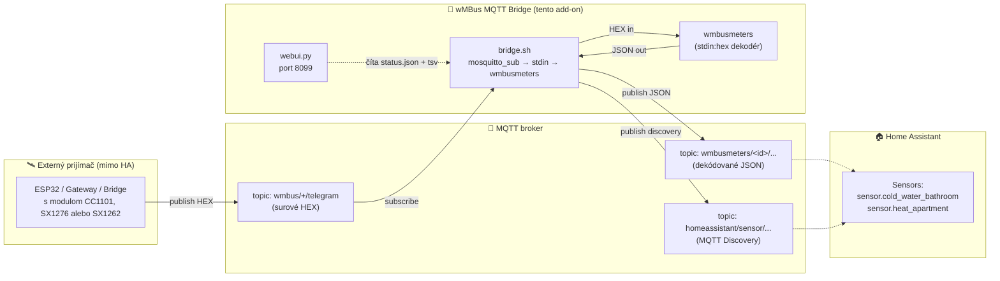
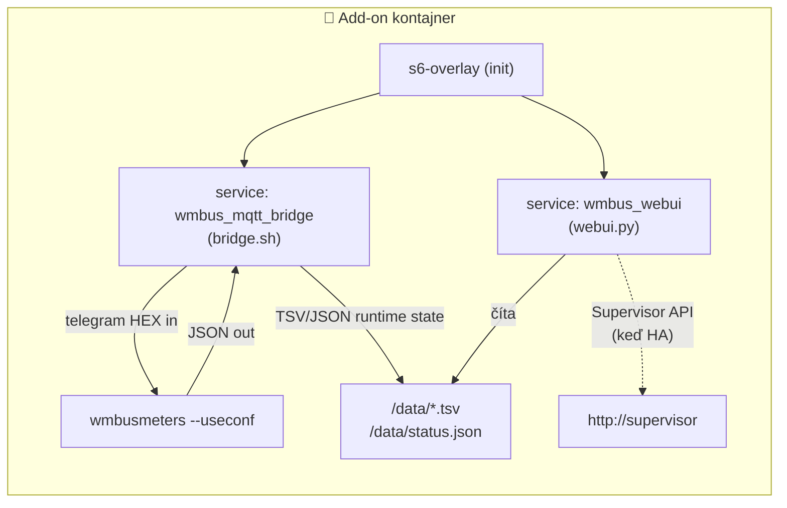
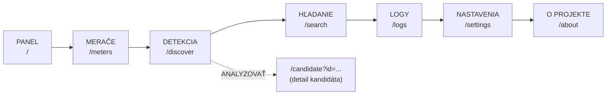
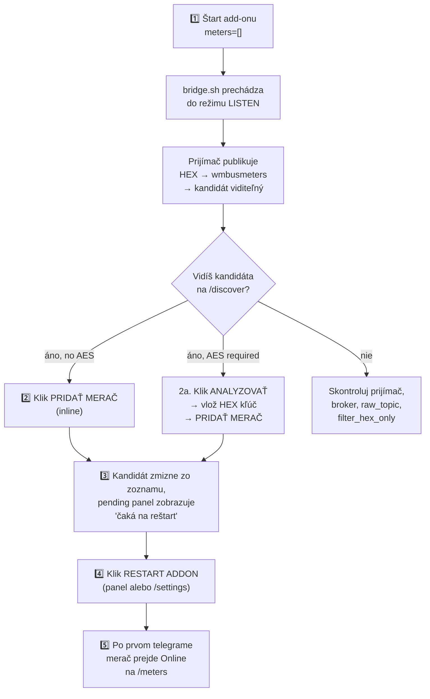
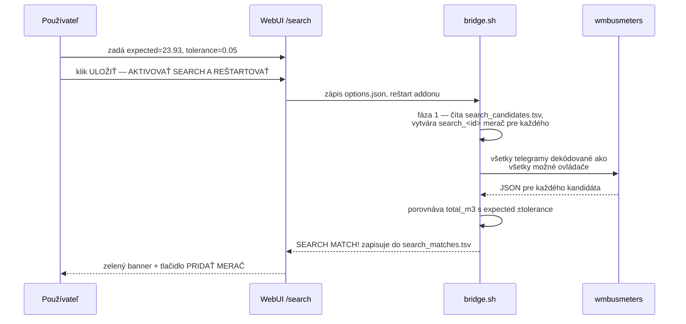
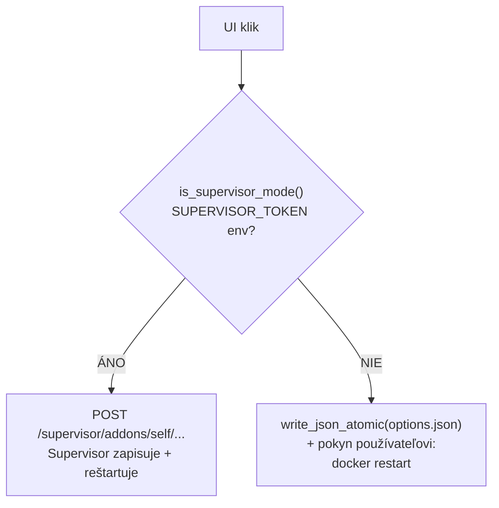
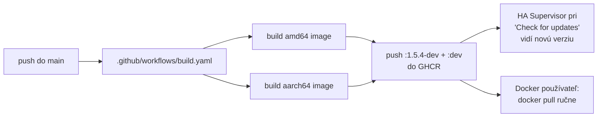

> 🌐 [EN](README.en.md) | [PL](README.pl.md) | [DE](README.de.md) | [CS](README.cs.md) | [**SK**](README.sk.md)

> 🤖 **Strojový preklad** — Táto dokumentácia bola strojovo preložená z poľštiny. Môže obsahovať chyby.

# wMBus MQTT Bridge — kompletná dokumentácia (SK)

> Verzia dokumentu: **1.5.4-dev**  ·  Jazyk: **slovenčina**  ·  Stav: dev-channel Home Assistant add-onu
>
> Krátky dvojjazyčný prehľad nájdete v hlavnom [README.md](../README.md). Tento dokument je úplná slovenská dokumentácia projektu — od „čo to je" po detaily architektúry a runtime.

---

## Obsah

1. [TL;DR — čo to robí](#1-tldr--čo-to-robí)
2. [Architektúra toku dát](#2-architektúra-toku-dát)
3. [Rýchly štart — Home Assistant](#3-rýchly-štart--home-assistant)
4. [Rýchly štart — Docker standalone](#4-rýchly-štart--docker-standalone)
5. [WebUI — 7 pohľadov](#5-webui--7-pohľadov)
6. [Typický workflow: od prázdna k fungujúcemu meraču](#6-typický-workflow-od-prázdna-k-fungujúcemu-meraču)
7. [Režim SEARCH — keď LISTEN počuje príliš veľa cudzích meračov](#7-režim-search--keď-listen-počuje-príliš-veľa-cudzích-meračov)
8. [Kompletná referencia konfigurácie](#8-kompletná-referencia-konfigurácie)
9. [MQTT témy — čo publikujeme, čo konzumujeme](#9-mqtt-témy--čo-publikujeme-čo-konzumujeme)
10. [Runtime súbory v `/data/`](#10-runtime-súbory-v-data)
11. [Home Assistant vs Docker — rozdiely UX](#11-home-assistant-vs-docker--rozdiely-ux)
12. [Lokalizácia UI](#12-lokalizácia-ui)
13. [Riešenie problémov](#13-riešenie-problémov)
14. [Architektúra kódu — pre vývojárov](#14-architektúra-kódu--pre-vývojárov)
15. [Verzovanie a Docker image](#15-verzovanie-a-docker-image)
16. [Licencia a upstream projekty](#16-licencia-a-upstream-projekty)

---

## 1. TL;DR — čo to robí

> **V jednej vete:** Add-on dekóduje Wireless M-Bus telegramy (vodomery, merače tepla, elektromery) **bez lokálneho USB donglu** — surové HEX telegramy mu dodáva ľubovoľný externý prijímač (ESP32, bridge, gateway) cez MQTT.

Štandardne `wmbusmeters` vyžaduje rádiový dongle pripojený k hostiteľovi. Tento projekt to rieši inak:

- **Ty** máš rádiový prijímač ďaleko od Home Assistant (napr. ESP32 na povale s anténou).
- **Prijímač** publikuje surové HEX rámce do MQTT.
- **Tento add-on** sa pripojí k brokeru, kŕmi `wmbusmeters` cez `stdin:hex`, dekóduje JSON a publikuje výsledok späť do MQTT + Home Assistant Discovery.

Výsledok: **Tvoje merače sa objavia ako senzory v HA, bez akéhokoľvek rádiového hardvéru na strane HA.**

> 🤝 **Spolupráca s ESPHome firmvérom** — Tento add-on sa typicky používa spolu s [`esphome-wmbus-bridge-rawonly`](https://github.com/Kustonium/esphome-wmbus-bridge-rawonly), ESPHome komponentom bežiacim na ESP32 s rádiovým čipom **CC1101, SX1276 alebo SX1262**. ESP prijíma rádiové rámce a publikuje surové HEX do MQTT; tento add-on ich dekóduje. Oba projekty sú **nezávislé** — add-on prijíma HEX z akéhokoľvek zdroja publikujúceho do nakonfigurovaného `raw_topic`.

---

## 2. Architektúra toku dát

### Dátová pipeline



### Mapa komponentov vo vnútri kontajnera



**Tri paralelne bežiace procesy** spravované `s6-overlay`:

| Proces | Čo robí | Súbor |
|---|---|---|
| `bridge.sh` | Odoberá MQTT, kŕmi wmbusmeters HEXom, parsuje JSON, publikuje výsledky | [rootfs/usr/bin/bridge.sh](../rootfs/usr/bin/bridge.sh) |
| `wmbusmeters` | Dekodér telegramov (upstream binárka — Fredrik Öhrström) | `/usr/bin/wmbusmeters` |
| `webui.py` | HTTP server na porte 8099, správny panel | [rootfs/usr/bin/webui.py](../rootfs/usr/bin/webui.py) |

Tieto tri komponenty komunikujú iba cez **súbory v `/data/`** — žiadne sockety vo vnútri kontajnera. Vďaka tomu sa dá webui reštartovať nezávisle od bridge a stav prežíva reštarty.

> 🔗 **Na strane prijímača (ESP32 s rádiom)** — používame sesterský projekt Kustonia: **[esphome-wmbus-bridge-rawonly-dev](https://github.com/Kustonium/esphome-wmbus-bridge-rawonly-dev)** — ESPHome firmware pre SX1262 / SX1276 / CC1101 publikujúci surové HEX na `wmbus/<device>/telegram`. Topic presne zodpovedá nášmu predvolenému `raw_topic: wmbus/+/telegram` — na našej strane nie je potrebné nič konfigurovať. Prijímač má vlastnú úplnú dokumentáciu (EN/PL) — začni s [`START_HERE.md`](https://github.com/Kustonium/esphome-wmbus-bridge-rawonly-dev/blob/main/docs/START_HERE.md).

---

## 3. Rýchly štart — Home Assistant

### Krok 1 — pridaj repozitár

V HA: **Settings → Add-ons → Add-on Store → ⋮ (menu) → Repositories**, pridaj:

```
https://github.com/Kustonium/homeassistant-wmbus-mqtt-bridge
```

### Krok 2 — nainštaluj add-on

V store nájdi **wMBus MQTT Bridge Dev** (sekcia „dev"), klikni **Install**.

> ⚠️ Neinštaluj oficiálny `wmbusmeters` add-on paralelne — tento projekt má vlastnú inštanciu wmbusmeters a duplikuje ju.

### Krok 3 — spusti s prázdnym zoznamom `meters` (režim LISTEN)

Klikni **Start**. Predvolene `meters: []` — add-on prejde do režimu LISTEN a iba počúva, nič ešte nekonfiguruje.

### Krok 4 — otvor WebUI

Na záložke **Info** add-onu klikni **OPEN WEB UI**. Privíta ťa dashboard:

```
┌────────────────────────────────────────────────────────────────┐
│ wMBus MQTT Bridge                              [EN PL DE CS SK]│
│ Panel | Merače | Detekcia | Hľadanie | Logy | Nastavenia | ⋮  │
├────────────────────────────────────────────────────────────────┤
│ Panel                                                          │
│ Stav pipeline za behu...                                       │
│                                                                │
│ [System status]  [Statistics]  [Discovery]                     │
│                                                                │
│ Nakonfigurované merače                                         │
│   (prázdne)                                                    │
│                                                                │
│ Detegovaní kandidáti                                           │
│   12 kandidátov / OTVORIŤ DETEKCIU                             │
└────────────────────────────────────────────────────────────────┘
```

### Krok 5 — choď na „Detekcia" a pridaj merač

Na záložke **DETEKCIA** uvidíš zoznam kandidátov. Pre každého bez požiadavky na AES kľúč — tlačidlo **PRIDAŤ MERAČ** priamo v riadku. Klik, reštart, hotovo.

➡️ Plný popis tohto workflowu v [§6 Typický workflow](#6-typický-workflow-od-prázdna-k-fungujúcemu-meraču).

---

## 4. Rýchly štart — Docker standalone

Pre všetkých mimo Home Assistant (DietPi, Ubuntu, Raspberry Pi OS, NAS atď.).

### Požiadavky

- Docker + docker compose
- Funkčný MQTT broker (Mosquitto, EMQX, …) dostupný z hostiteľa
- Rádiový prijímač publikujúci HEX rámce do brokeru — napr. [esphome-wmbus-bridge-rawonly-dev](https://github.com/Kustonium/esphome-wmbus-bridge-rawonly-dev) (publikuje na `wmbus/<device>/telegram`, kompatibilný out-of-the-box)

### Inštalácia

```bash
git clone https://github.com/Kustonium/homeassistant-wmbus-mqtt-bridge.git
mkdir -p /home/wmbus-test
cp -a homeassistant-wmbus-mqtt-bridge/docker/examples/* /home/wmbus-test/
cd /home/wmbus-test
docker compose up -d --build
docker compose logs -f wmbus
```

Prvé logy by mali ukazovať:

```
[wmbus-bridge] mqtt: connected to 192.168.1.10:1883
[wmbus-bridge] No meters configured -> LISTEN MODE
```

### Konfigurácia

Edituj `./config/options.json`. Úplná referencia polí v [§8](#8-kompletná-referencia-konfigurácie). Minimálny príklad:

```json
{
  "raw_topic": "wmbus_bridge/+/telegram",
  "loglevel": "normal",
  "discovery_enabled": true,
  "state_prefix": "wmbusmeters",
  "mqtt_mode": "external",
  "external_mqtt_host": "192.168.1.10",
  "external_mqtt_port": 1883,
  "external_mqtt_username": "user",
  "external_mqtt_password": "pass",
  "meters": []
}
```

Po editácii:

```bash
docker compose restart wmbus
```

### WebUI v Dockeri

Vystav port 8099 v `docker-compose.yml`:

```yaml
services:
  wmbus:
    ports:
      - "8099:8099"
```

Potom otvor `http://<host-ip>:8099/`.

> 💡 V režime Docker UI deteguje chýbajúci `SUPERVISOR_TOKEN` a nahradí tlačidlá RESTART pokynom `docker restart <container>` — viď [§11](#11-home-assistant-vs-docker--rozdiely-ux).

---

## 5. WebUI — 7 pohľadov

WebUI je dostupné v **5 jazykoch** (EN/PL/DE/CS/SK) — prepínač v pravom hornom rohu. Jazyk je detegovaný z (v poradí): `?lang=`, cookie `wmbus_lang`, hlavička `Accept-Language`.

Všetky stránky sa automaticky obnovujú každých 15 sekúnd (okrem `/candidate`).

### Mapa záložiek



### 5.1. Panel (`/`)

Tri karty hore: **System status** (MQTT, RAW telegrams, wmbusmeters, decoded JSON, configured meters, HA Discovery), **Statistics** (čísla + mini-bary), **Discovery status** (prefixy + počet meračov/kandidátov).

Nižšie: kompaktná mriežka nakonfigurovaných meračov + zhrnutie kandidátov s tlačidlom „OTVORIŤ DETEKCIU".

Ak máš **pending changes** (pridal si niečo pred reštartom) — žltý panel sa objaví tu, na `/meters` a na `/discover`. Viď [§6](#krok-3--pozri-sa-čo-čaká-na-reštart).

### 5.2. Merače (`/meters`)

Plná mriežka **dekódovaných** meračov. Každá karta:

```
┌──────────────────────────────┐
│ 💧 cold_water_bathroom       │
│ 41553221 / mkradio3          │
│                              │
│ total_m3                     │
│ 123.456                      │
│ ─────────────────────────    │
│ Media:    water              │
│ Reception: ~30 min           │
│ Seen 15m:  2  Seen 60m: 5    │
│ ─────────────────────────    │
│ [Online]            [DELETE] │
└──────────────────────────────┘
```

Hlavná hodnota je **aktuálna** okamžitá hodnota alebo stav merača (od verzie 1.5.2-dev — viď [§13](#13-riešenie-problémov)).

### 5.3. Detekcia (`/discover`)

Tabuľka kandidátov z LISTEN módu. Pre každého vidíš: ID, ovládač, médium (💧/⚡/🔥/📡), šifrovanie (AES required / no AES / —), príjem (15m/60m), posledný telegram, akcie.

**Akcie** závisia od šifrovacieho pillu:

| Pill | Tlačidlá |
|---|---|
| 🟢 **no AES** alebo sivé **—** | `[PRIDAŤ MERAČ] [ANALYZOVAŤ] [IGNOROVAŤ]` — inline ADD, jedno kliknutie = zápis do `options.json` |
| 🔴 **AES required** | `[ANALYZOVAŤ] [IGNOROVAŤ]` — musíš ísť na `/candidate` a vložiť 32-znakový HEX kľúč |

Filtre médií hore: **Všetko / Voda / Elektrina / Teplo / Ostatné**. Druhý odkaz `[Ignorovaní]` zobrazuje predtým ignorovaných kandidátov (s možnosťou OBNOVIŤ).

### 5.4. Hľadanie (`/search`)

Servisný režim — používa sa keď LISTEN vráti desiatky cudzích meračov (napr. bytovka) a nevieš, ktorý je tvoj. Viď dedikovaná sekcia [§7](#7-režim-search--keď-listen-počuje-príliš-veľa-cudzích-meračov).

UI má 3 (kontextové) banery:

- 🟢 **MATCH FOUND** — keď je zhoda nájdená
- 🟢 **SEARCH MODE ACTIVE** — beží, čaká na ďalšie telegramy
- 🟡 **SEARCH MODE — konfigurácia** — pred aktiváciou

Plus formulár konfigurácie (m³ odpočet + tolerancia) a živý status z bridge.sh (KV: phase, cached, ignored, loaded, decoded, checked, matches, last candidate, last checked, last reason).

### 5.5. Logy (`/logs`)

Krátky prúd runtime udalostí z [`status_events.tsv`](#10-runtime-súbory-v-data) — RAW received, candidate detected, errors. Úplné logy sú stále v záložke HA add-onu **Log**.

### 5.6. Nastavenia (`/settings`)

Zobrazuje aktívnu runtime konfiguráciu (zo `status.json`):
- `raw_topic`, `state_prefix`, `discovery_prefix`
- `search_mode`, `search_expected_value_m3`, `search_tolerance_m3`
- `loglevel`, MQTT host, počet ignorovaných kandidátov

Plus blok **RESTART ADDON** (alebo v režime Docker: pokyn `docker restart`) a zoznam runtime súborov + tlačidlo **MANAGE IGNORED CANDIDATES** (presmerovanie na `/discover?ignored=1`).

### 5.7. O projekte (`/about`)

Krátky popis architektúry a ASCII diagram.

---

## 6. Typický workflow: od prázdna k fungujúcemu meraču



### Krok 1 — prvé spustenie

`meters: []` v konfigurácii. Add-on štartuje, pripojí sa k brokeru, čaká. V logoch:

```
[wmbus-bridge] mqtt: connected
[wmbus-bridge] No meters configured -> LISTEN MODE
[wmbus-bridge][INFO] === NEW METER CANDIDATE DETECTED ===
[wmbus-bridge][INFO] Received telegram from: 41553221
[wmbus-bridge][INFO] Suggested driver: mkradio3
```

WebUI → **Detekcia** ukazuje 41553221 s ovládačom `mkradio3`.

### Krok 2 — pridaj kandidáta

Pre merač bez šifrovania: v riadku **DETEKCIA** klikni `PRIDAŤ MERAČ`. Pod kapotou:

1. POST `/add-meter` → `add_meter_to_options(meter_id, driver, "")` vo `webui.py`
2. Kontrola `SUPERVISOR_TOKEN`:
   - **Je** → POST na `http://supervisor/addons/self/options` s celým poľom `meters[]` → Supervisor perzistentne zapíše
   - **Nie je** → `write_json_atomic(/data/options.json, ...)` — priamy zápis súboru
3. Redirect späť na `/discover?added=...`

Výsledok: merač je v `options.json`, ale **wmbusmeters ho ešte nepozná** (naučí sa až po reštarte).

### Krok 3 — pozri sa „čo čaká na reštart"

WebUI hneď ukáže, že máš neaktívne zmeny:

**Žltý panel hore na /discover, /meters a dashboarde:**

```
┌─────────────────────────────────────────────────────────────┐
│ ⚠ Čakajúce zmeny — čakajú na reštart (2)                    │
│ Tieto merače sú v options.json, ale add-on ich ešte         │
│ neprevzal. Reštartujte add-on pre načítanie.                │
│ ┌─────────────────────────────────────────────┐             │
│ │ Meter ID   │ Driver       │ AES             │             │
│ │ 41553221   │ mkradio3     │ bez AES kľúča   │             │
│ │ aabbccdd   │ amiplus      │ kľúč nastavený  │             │
│ └─────────────────────────────────────────────┘             │
│                                                             │
│ [ REŠTARTOVAŤ ADD-ON TERAZ ]                                │
└─────────────────────────────────────────────────────────────┘
```

Plus sivé/prerušované „pending" karty v mriežke nakonfigurovaných meračov s nápisom „Čaká / čaká na reštart".

Mechanizmus funguje porovnaním `options.json` ↔ `status_meters.tsv`. Záznam zmizne z pending automaticky, akonáhle wmbusmeters dekóduje prvý telegram pre toto ID.

### Krok 4 — reštart

V režime HA: klik **REŠTARTOVAŤ ADD-ON TERAZ** → POST `/restart-bridge` → volanie `http://supervisor/addons/self/restart`.

V režime Docker: namiesto tlačidla — pokyn `docker restart <container>`. Viď [§11](#11-home-assistant-vs-docker--rozdiely-ux).

### Krok 5 — hotovo

Po reštarte dostane wmbusmeters novú konfiguráciu, čaká na ďalší telegram. Keď príde:

1. JSON pristane v MQTT (`wmbusmeters/<id>/...`)
2. `bridge.sh` zapíše záznam do `status_meters.tsv`
3. WebUI pri ďalšom refreshi (15s) zobrazí merač ako **Online** namiesto „Pending"
4. HA Discovery automaticky vytvorí entity `sensor.<id>_total_m3` atď.

---

## 7. Režim SEARCH — keď LISTEN počuje príliš veľa cudzích meračov

V bytovke tvoj prijímač zachytí 30-50 telegramov od susedov. LISTEN ukáže 30 kandidátov. Ktorý je tvoj?

**SEARCH to rieši porovnaním m³ odpočtu z displeja fyzického merača** s dekódmi všetkých kandidátov.

### Fázy



### Konfigurácia cez UI

Choď na `/search`:

1. **Odpočet merača** — zadaj aktuálnu hodnotu z displeja, napr. `23.93` alebo `23,93` (oba akceptované)
2. **Tolerancia m³** — predvolené `0.05` (50 litrov). V bytovke **nepoužívaj `0.5`** — veľa meračov môže mať podobné hodnoty
3. Klik **ULOŽIŤ — AKTIVOVAŤ SEARCH A REŠTARTOVAŤ**

Add-on sa reštartuje a prejde do SEARCH MODE. Čakaj na ďalšie telegramy (typické intervaly: 30 s — 15 min v závislosti od merača).

### Výsledok

Keď je zhoda nájdená:

```
[wmbus-bridge][WARN] SEARCH MATCH: id=03534159 driver=hydrodigit
  media=water field=total_m3 value=23.932 m3
  expected=23.93 diff=0.002000 m3
[wmbus-bridge][WARN] SEARCH SUGGESTED CONFIG:
  {"id":"meter_03534159","meter_id":"03534159","type":"hydrodigit",
   "type_other":"","key":""}
```

WebUI na `/search` ukazuje:

```
✅ SEARCH MODE — NÁJDENÁ ZHODA
Hlavný výsledok: nájdená zhoda (1)

┌──────────────────────────────────────────────────────┐
│ 03534159  hydrodigit · water                         │
│ value: 23.932 m³ · expected: 23.93 m³ · diff: 0.002  │
│ {"id":"meter_03534159","meter_id":"03534159",...}    │
│                                                      │
│ [ PRIDAŤ MERAČ ]  [ KOPÍROVAŤ KONFIG ]               │
└──────────────────────────────────────────────────────┘
```

Klik PRIDAŤ MERAČ → uložené do `options.json`, reštart, hotovo.

### Po dokončení

- **Vypni `search_mode`** — vracia sa k normálnej práci s `meters[]`
- Dočasné `search_*` merače nevytvárajú entity v HA
- Súbory `/data/search_candidates.tsv` a `/data/search_matches.tsv` možno zmazať, aby ďalšie hľadanie začínalo s čistým stavom

---

## 8. Kompletná referencia konfigurácie

Z [`config.yaml`](../config.yaml):

### MQTT — vstup / výstup

| Pole | Typ | Predvolené | Popis |
|---|---|---|---|
| `raw_topic` | str | `wmbus/+/telegram` | Topic so surovým HEX z prijímača. `+` je MQTT wildcard — zodpovedá jednému segmentu |
| `filter_hex_only` | bool | `true` | Ignoruj MQTT správy, ktoré nevyzerajú ako HEX (chráni pred odpadom) |
| `mqtt_mode` | enum | `auto` | `auto` (HA broker ak je dostupný, inak external), `ha` (vynúť HA), `external` (vždy externý) |
| `external_mqtt_host` | str? | `""` | Host externého brokeru (keď `mqtt_mode=external`) |
| `external_mqtt_port` | int | `1883` | Port externého brokeru |
| `external_mqtt_username` | str? | `""` | Používateľ brokeru |
| `external_mqtt_password` | str? | `""` | Heslo brokeru |

### Discovery a výstup

| Pole | Typ | Predvolené | Popis |
|---|---|---|---|
| `discovery_enabled` | bool | `true` | Publikuje konfiguráciu HA Discovery |
| `discovery_prefix` | str | `homeassistant` | Štandardný HA Discovery prefix |
| `discovery_retain` | bool | `true` | Discovery správy ako retained |
| `state_prefix` | str | `wmbusmeters` | Topic prefix pre hodnoty meračov |
| `state_retain` | bool | `false` | Retained pre state (obvykle nechcete, HA aj tak sťahuje) |

### Režim SEARCH

| Pole | Typ | Predvolené | Popis |
|---|---|---|---|
| `search_mode` | bool | `false` | Aktivuje SEARCH (viď [§7](#7-režim-search--keď-listen-počuje-príliš-veľa-cudzích-meračov)) |
| `search_expected_value_m3` | float | `0` | Očakávaný m³ odpočet z fyzického merača |
| `search_tolerance_m3` | float | `0.05` | Tolerancia zhody — v bytovke nepoužívaj >`0.05` |
| `search_delta_mode` | bool | `false` | (Experimentálne) Porovnáva deltu namiesto absolútnej hodnoty |
| `search_min_delta_m3` | float | `0.001` | Prah delty v `search_delta_mode` |
| `search_topic` | str | `wmbus/search/candidates` | Voliteľné MQTT téma pre výsledky search |

### Debug

| Pole | Typ | Predvolené | Popis |
|---|---|---|---|
| `loglevel` | enum | `normal` | `normal` / `verbose` / `debug` — verbose loguje každý prijatý RAW |
| `debug_every_n` | int | `0` | Loguj diagnostiku každý N-tý telegram (0 = vyp) |

### Merače — `meters[]`

Každý záznam je objekt:

| Pole | Typ | Povinné | Popis |
|---|---|---|---|
| `id` | str | áno | Tvoj štítok, použitý v MQTT topiku a názve HA senzora |
| `meter_id` | str | áno | 8-znakový HEX, sériové číslo merača (z LISTEN) |
| `type` | enum | áno | wmbusmeters ovládač — úplný zoznam 100+ v [`config.yaml:75`](../config.yaml#L75) alebo `auto`/`other` |
| `type_other` | str? | len keď `type=other` | Vlastné meno ovládača |
| `key` | str? | len pre šifrované merače | 32-znakový HEX, AES kľúč |

Najčastejšie ovládače pre vodu a teplo: `multical21`, `iperl`, `flowiq2200`, `mkradio3`, `mkradio4`, `kamwater`, `hydrodigit`, `hydrus`. Elektrina: `amiplus`. Teplo: `kamheat`, `hydrocalm3`, `qcaloric`.

---

## 9. MQTT témy — čo publikujeme, čo konzumujeme

### Odoberáme (vstup)

```
<raw_topic>  →  napr. wmbus/<receiver_id>/telegram
```

Payload: surové HEX z wM-Bus telegramu, ASCII. Každý znak `[0-9A-Fa-f]`, dĺžka typicky 40-200 znakov. Bridge filtruje payloady nezodpovedajúce HEX (keď `filter_hex_only=true`).

Príklad publikácie od prijímača:

```bash
mosquitto_pub -h broker -t 'wmbus/esp32-attic/telegram' \
  -m '244D8C0682185601A06D7AE3000000020FFCB39D000000000B6E000000'
```

### Publikujeme (výstup)

#### State (dekódované hodnoty)

```
<state_prefix>/<id>/state
```

Napr. pre merač `id=cold_water_bathroom`:

```
wmbusmeters/cold_water_bathroom/state
  →  {"id":"cold_water_bathroom","name":"...","media":"water","total_m3":123.456,"flow_m3h":0.0,"timestamp":"2026-05-17T10:00:00+02:00"}
```

Celý dekódovaný telegram je publikovaný ako JSON payload na jednom state topicu na merač; HA vyberá jednotlivé polia z neho cez `value_template` v Discovery.

#### Home Assistant Discovery

```
<discovery_prefix>/sensor/<id>_<field>/config
```

Napr.:

```
homeassistant/sensor/wmbus_cold_water_bathroom/total_m3/config
  →  {"name":"cold_water_bathroom total_m3",
      "state_topic":"wmbusmeters/cold_water_bathroom/state",
      "value_template":"{{ value_json.get('total_m3') | default(none) }}",
      "json_attributes_topic":"wmbusmeters/cold_water_bathroom/state",
      "expire_after":3600,
      "unit_of_measurement":"m³",
      "device_class":"water",
      "state_class":"total_increasing",
      "unique_id":"wmbus_cold_water_bathroom_total_m3",
      ...}
```

#### SEARCH (voliteľne)

```
<search_topic>  →  napr. wmbus/search/candidates
```

Kandidáti nájdení v LISTEN fáze režimu SEARCH sú publikovaní tu.

---

## 10. Runtime súbory v `/data/`

Všetky súbory zdieľané medzi `bridge.sh` ↔ `webui.py` žijú v `/data/`:

| Súbor | Formát | Zapisuje | Číta | Obsah |
|---|---|---|---|---|
| `options.json` | JSON | Supervisor / `webui.py` (fallback) | `bridge.sh`, `webui.py` | Hlavná konfigurácia add-onu |
| `status.json` | JSON | `bridge.sh` | `webui.py` | Snapshot stavu pipeline (MQTT connected, counts, config echo) |
| `status_meters.tsv` | TSV | `bridge.sh` | `webui.py` | Dekódované merače — jeden riadok na meter_id |
| `status_candidates.tsv` | TSV | `bridge.sh` | `webui.py` | LISTEN kandidáti |
| `status_candidate_analysis.tsv` | TSV | `bridge.sh` | `webui.py` | Analýza šifrovania kandidátov |
| `status_events.tsv` | TSV | `bridge.sh`, `webui.py` | `webui.py` | Posledných 80 udalostí (RAW received, errors, UI actions) |
| `status_seen.tsv` | TSV | `bridge.sh` | `bridge.sh` | História intervalov príjmu (pre seen_15m/seen_60m štatistiky) |
| `status_ignored_candidates.tsv` | text | `webui.py` | `bridge.sh`, `webui.py` | Zoznam ID ignorovaných používateľom |
| `status_raw_count.txt` | int | `bridge.sh` | `bridge.sh` | Počítadlo všetkých RAW telegramov tejto session |
| `status_last_raw_seen.txt` | ISO time | `bridge.sh` | `bridge.sh`, `webui.py` | Časová pečiatka posledného RAW |
| `status_recent_raw.tsv` | TSV | `bridge.sh` | (pre debug) | Kruhový buffer posledných N RAW HEX hodnôt |
| `search_candidates.tsv` | TSV | `bridge.sh` | `bridge.sh` | Vodomerné kandidáti pre SEARCH |
| `search_matches.tsv` | TSV | `bridge.sh` | `webui.py` | Zhody nájdené v SEARCH |
| `search_status.json` | JSON | `bridge.sh` | `webui.py` | Živý SEARCH status (fáza, čísla) |

> ⚠️ Súbory v `/data/etc/` sú **generované pri štarte** — needituj ručne.

Tieto súbory prežívajú reštart kontajnera (mountovaný `/data` volume), ale `options.json` v HA je prepisovaný zo stavu Supervisora — ručné editácie súboru neprežijú reštart v režime HA.

---

## 11. Home Assistant vs Docker — rozdiely UX

Jedna kódová báza, dva módy behu. UI sama deteguje mód podľa prítomnosti `SUPERVISOR_TOKEN` v prostredí (HA injektuje, keď `hassio_api: true`).

### Čo funguje identicky

✅ Celé WebUI (Panel, Merače, Detekcia, Hľadanie, Logy, Nastavenia, O projekte)
✅ Lokalizácia 5 jazykov
✅ Inline ADD v tabuľke kandidátov (rozdiel iba v zápise: API vs súbor)
✅ Pending panel
✅ Bridge.sh — dekódovanie, MQTT, Discovery
✅ Výber okamžitých hodnôt (current_power_kw namiesto total_kwh)

### Čo sa líši

| Akcia | Home Assistant | Docker standalone |
|---|---|---|
| Pridanie merača | POST `http://supervisor/addons/self/options` (perzistentné) | `write_json_atomic(/data/options.json)` (súbor) |
| Banner po pridaní | „Kliknite RESTART ADDON nižšie…" | „Reštartujte kontajner manuálne pre aplikovanie." |
| Pending panel — reštart tlačidlo | `[REŠTARTOVAŤ ADD-ON TERAZ]` (POST `/restart-bridge`) | Pokyn: `docker restart <container>` |
| `/settings` — reštart sekcia | Tlačidlo + supervisor_api_notice | Žltá karta s pokynom |
| `/candidate` — RESTART ADDON | POST tlačidlo | Pokyn |
| Stiahnutie nového image | HA Supervisor automaticky pri „Update Available" | `docker pull ...` ručne |
| Perzistencia zmien | Supervisor (Supervisor DB) | `/data` volume |

### Prečo tak

V Dockeri nie je Supervisor API. Volanie `http://supervisor/addons/self/restart` by vrátilo chybu. Namiesto zobrazenia rozbitého tlačidla používateľovi, UI sama deteguje chýbajúci token a nahradí ho textovou inštrukciou.



---

## 12. Lokalizácia UI

WebUI podporuje 5 jazykov:

| Kód | Jazyk | Pokrytie |
|---|---|---|
| `en` | English | 100% |
| `pl` | Polski | 100% |
| `de` | Deutsch | 100% |
| `cs` | Čeština | 100% |
| `sk` | Slovenčina | 100% |

### Ako je zvolený jazyk

Hierarchia (prvá zhoda vyhráva):

1. **URL** — `?lang=pl` na konci adresy
2. **Cookie** — `wmbus_lang=pl` (nastavované pri kliknutí na prepínač)
3. **Hlavička** — `Accept-Language` od prehliadača (napr. `pl-PL, en;q=0.9`)
4. **Predvolené** — `en`

### Ako prepnúť

Pravý horný roh každej stránky:

```
[EN]  PL   DE   CS   SK
```

Aktívny jazyk zvýraznený. Klik = nastaví cookie a znova načíta stránku.

### Pre vývojárov

Všetky preklady sú v jednom súbore — [rootfs/usr/bin/i18n.py](../rootfs/usr/bin/i18n.py). 153 kľúčov × 5 jazykov. Pridanie nového kľúča:

1. Pridaj do `I18N["en"]`, `I18N["pl"]`, … všetkých 5 slovníkov
2. Použi vo `webui.py` ako `tr(lang, "tvoj_kluc")`

Preklady sú aplikované cez priame volania `tr()` — starý mechanizmus `localize_html` (string replacement) je len fallback.

---

## 13. Riešenie problémov

### „Nevidím žiadne telegramy" (RAW count = 0)

Skontroluj postupne:

1. **Publikuje prijímač na správne tému?**
   - Tvoja konfigurácia má `raw_topic: "wmbus/+/telegram"` — prijímač musí publikovať na `wmbus/<čokoľvek>/telegram`
   - Manuálny test:
     ```bash
     mosquitto_sub -h <broker> -t 'wmbus/#' -v
     ```
2. **Je bridge odoberané?** Logy by mali obsahovať:
   ```
   [wmbus-bridge] mqtt: connected
   [wmbus-bridge] mqtt: subscribed to wmbus/+/telegram
   ```
3. **Neodmieta `filter_hex_only`?** Aktivuj `loglevel: verbose` a pozri sa, či logy hovoria `dropped (not HEX)`. Tvoj prijímač možno posiela base64 alebo JSON — v týchto prípadoch vypni filter alebo zmeň formát.
4. **Je broker dosiahnuteľný?** `mqtt_mode=auto` skúša HA, potom external. Skontroluj logy pre connection error.

### „Kandidát pridaný, ale merač sa neobjavuje v Merače"

- Klik na **PRIDAŤ MERAČ** zapisuje do `options.json`, ale **nereštartuje wmbusmeters**. Musíš reštartovať add-on.
- WebUI to ukazuje cez **pending panel** (žltý, hore na /discover, /meters, dashboarde).
- Po reštarte dostane wmbusmeters nový zoznam, ale potrebuje **ďalší telegram** pre dekódovanie — môže to trvať od niekoľkých desiatok sekúnd až do mnohých minút v závislosti od intervalu merača.

### „Hodnota ukazuje číslo, ktoré iba rastie, nie okamžité"

Od verzie **1.5.2-dev** UI preferuje okamžité polia (`current_power_kw`, `volume_flow_m3h`, `_kw$`/`_w$`/`_m3h$`/`_l_h$`) pred totals (`total_energy_consumption_kwh`).

Pre vodomer bez `volume_flow_m3h` (napr. mkradio3) — `total_m3` je jediné zmysluplné pole a to sa zobrazuje. Je to **stav merača** (ako na displeji vodomera), nie kumulatívna spotreba — aj keď číslo rastie, je aktuálne pre dnešok.

Úplná logika výberu [v bridge.sh — `status_meter_seen`](../rootfs/usr/bin/bridge.sh).

### „HA neukazuje aktualizáciu add-onu"

HA Supervisor deteguje novú verziu len keď sa `version:` v `config.yaml` zmení. Tag image na GHCR je odvodený z `version:`. Viď [§15](#15-verzovanie-a-docker-image).

Vynútená kontrola: **Settings → System → ⋮ → Reload** alebo `ha supervisor restart` z CLI HA hostiteľa.

### „Mám šifrovaný merač, ale neviem, odkiaľ vziať AES kľúč"

AES kľúč dodáva:
- **Dodávateľ meračov** (správca budovy, dodávateľ vody/tepla)
- **Nálepka na merači** (zriedka)
- **Dokumentácia merača** (ak máš)

Bez kľúča nedekóduješ šifrované telegramy. Niektoré merače používajú tzv. „zero-key" (`00000000000000000000000000000000`) ako fasádové šifrovanie — niekedy funguje.

### „Inline ADD nič neurobil" (v Dockeri)

Skontroluj:
- Je adresár `./config/` **zapisovateľný** pre používateľa kontajnera (nie `:ro`)
- Je v logu `Meter added to options.json (file only — no SUPERVISOR_TOKEN)` — to znamená, že súbor bol uložený. Reštartuj kontajner ručne.
- Skontroluj obsah `options.json` po kliknutí — mal by obsahovať nový záznam v `meters[]`.

---

## 14. Architektúra kódu — pre vývojárov

### Štruktúra repozitára

```
.
├── config.yaml                  # Manifest HA add-onu: opcie, schema, image
├── Dockerfile                   # Multi-stage: builder + docker + addon
├── repository.yaml              # Manifest HA repa
├── CHANGELOG.md
├── README.md
├── docs/                        # Úplná viacjazyčná dokumentácia
│   ├── README.en.md
│   ├── README.pl.md
│   ├── README.de.md
│   ├── README.cs.md
│   └── README.sk.md
├── docker/                      # Súbory iba pre Docker standalone
│   ├── entrypoint.sh
│   └── examples/                # docker-compose + príkladová config/
├── rootfs/                      # Kopírované do / v HA image
│   ├── etc/services.d/          # s6-overlay service definície
│   │   ├── wmbus_mqtt_bridge/
│   │   └── wmbus_webui/
│   └── usr/bin/
│       ├── bridge.sh            # 1400+ riadkov — hlavná slučka, MQTT, decode
│       ├── i18n.py              # Preklady pre 5 jazykov
│       ├── run.sh               # Startup wrapper pre HA režim
│       └── webui.py             # 1700+ riadkov — HTTP server, stránky, API
├── translations/                # Preklady HA add-on opcií (en.yaml, pl.yaml)
└── .github/workflows/           # CI: build-addon, shellcheck, yaml-lint
```

### Hlavné komponenty

#### `bridge.sh` (1400+ riadkov)

Bash, jeden proces. Hlavná slučka:

1. **Setup** — čítanie `options.json`, generovanie `wmbusmeters.conf` v `/data/etc/`
2. **MQTT subscribe** — `mosquitto_sub` na `raw_topic`, každý riadok → `process_raw_telegram`
3. **HEX → wmbusmeters** — predané cez `stdin:hex`
4. **JSON parse** — ďalší riadok z `mosquitto_sub` na wmbusmeters topiku
5. **Status update** — zápis do `status_meters.tsv`, `status_events.tsv`, `status.json`
6. **HA Discovery publish** — MQTT Discovery správy vypočítané pre každé nové pole
7. **SEARCH** — ak aktivované, dekóduje kandidátov z `search_candidates.tsv` paralelne

Kľúčové funkcie:
- `status_meter_seen()` ([riadok 316](../rootfs/usr/bin/bridge.sh#L316)) — zapisuje záznam do `status_meters.tsv`, vyberá value_key (okamžitý > kumulatívny)
- `status_candidate_seen()` ([riadok 341](../rootfs/usr/bin/bridge.sh#L341)) — registruje LISTEN kandidáta
- `process_raw_telegram()` — hlavná HEX → decode pipeline

#### `webui.py` (1700+ riadkov)

Python 3.12, `http.server.ThreadingHTTPServer`. Bez frameworku — surové HTTP + HTML stringy. Hlavné sekcie:

- **`state()`** ([riadok 583](../rootfs/usr/bin/webui.py#L583)) — číta všetky runtime súbory, vracia dict
- **`add_meter_to_options()`** ([riadok 385](../rootfs/usr/bin/webui.py#L385)) — Supervisor API + file fallback
- **`is_supervisor_mode()`** — deteguje HA vs Docker režim
- **`pending_meters()`** — diff `options.json` ↔ `status_meters.tsv`
- **`render_*()`** — funkcie renderujúce jednotlivé HTML fragmenty (system_status, stats, meter_card, candidates_table, …)
- **`page_*()`** — renderery celých stránok (`page_dashboard`, `page_meters`, `page_discover`, `page_search`, `page_candidate`, `page_logs`, `page_settings`, `page_about`)
- **`Handler` (BaseHTTPRequestHandler)** — GET/POST routing, language detection, cookie handling

Lokalizácia (`i18n.py`):
- `tr(lang, key)` — hlavná prekladová funkcia
- `localize_html(html, lang)` — legacy string-replacement (fallback)
- `detect_lang(headers, params)` — URL → cookie → Accept-Language → default

#### `wmbusmeters` (upstream)

Binárka kompilovaná z [upstream](https://github.com/wmbusmeters/wmbusmeters) v Dockerfile builder stage. Volaná s `stdin:hex` — číta HEX z stdin, dekóduje, publikuje JSON do MQTT.

> ⚙️ Patch v Dockerfile odstraňuje `-flto` z Makefile, pretože aktuálny Alpine toolchain má problémy s LTO.

### Lokálny build

```bash
# HA image build (multi-arch):
docker buildx build \
  --build-arg BUILD_FROM=ghcr.io/home-assistant/amd64-base:3.20 \
  --target addon \
  -t wmbus-mqtt-bridge:local \
  .

# Docker standalone image build:
docker buildx build \
  --build-arg BUILD_FROM=ghcr.io/home-assistant/amd64-base:3.20 \
  --target docker \
  -t wmbus-bridge-docker:local \
  .
```

### Lokálne testy webui.py

```bash
cd rootfs/usr/bin
WMBUS_BASE=/tmp/wmbus-test python webui.py
# Otvor http://localhost:8099/
```

S fake dátami (smoke test):

```python
import os, tempfile, json, pathlib
base = tempfile.mkdtemp()
os.environ['WMBUS_BASE'] = base
p = pathlib.Path(base)
p.joinpath('options.json').write_text(json.dumps({
    'meters': [{'id':'test','meter_id':'12345678','type':'multical21','key':''}]
}))
p.joinpath('status_meters.tsv').write_text('')
import webui
print(webui.render_page('/discover', {}, 'pl'))
```

---

## 15. Verzovanie a Docker image

### Schéma verzovania

`MAJOR.MINOR.PATCH-dev` — semver s `-dev` suffixom (vývojársky kanál).

| Časť | Bumpuje pri |
|---|---|
| MAJOR | Breaking change v konfigurácii / MQTT / discovery |
| MINOR | Nové funkcie (napr. lokalizácia, pending panel, inline ADD) |
| PATCH | Bug fixes, drobné UX |
| `-dev` | Pokiaľ sme vo vývojárskom kanále |

### GHCR image tagy

Každý build pushuje 2 tagy:

```
ghcr.io/kustonium/amd64-addon-wmbus_mqtt_bridge-dev:1.5.4-dev   ← verzia
ghcr.io/kustonium/amd64-addon-wmbus_mqtt_bridge-dev:dev          ← rolling latest
```

Plus to isté pre `aarch64-addon-...`. HA Supervisor používa tag verzie (z `image` + `version` v `config.yaml`).

### CI/CD workflow



Bump verzie v `config.yaml` je **vyžadovaný**, aby HA detegoval aktualizáciu — bez zmeny `version:` sa HA nepozrie na GHCR, ani keď bol image znova zostavený.

---

## 16. Licencia a upstream projekty

### Licencia

**GNU General Public License v3.0 (GPL-3.0)**

Toto repo obsahuje a modifikuje kód z projektu `wmbusmeters-ha-addon` (GPL-3.0). Celý projekt — vrátane forku, nových komponentov (webui.py, i18n.py, bridge.sh rewrite, pending panel, inline ADD) — je distribuovaný pod GPL-3.0.

### Upstream

- **wmbusmeters** — https://github.com/wmbusmeters/wmbusmeters (Fredrik Öhrström, GPL-3.0)
  - wM-Bus telegram dekodér, kompilovaný zo zdrojáku v Dockerfile
- **wmbusmeters-ha-addon** — https://github.com/wmbusmeters/wmbusmeters-ha-addon (GPL-3.0)
  - Pôvodný HA add-on, z ktorého fork štartoval

### Atribúcia

Projekt je fork vyvíjaný **Kustoniem**. Hlavný rozdiel oproti upstream: MQTT vstup namiesto lokálneho donglu, WebUI v poľštine/angličtine/nemčine/češtine/slovenčine, plný LISTEN → ADD → SEARCH workflow cez UI.

---

**Koniec dokumentácie.** Otázky, bugy, návrhy → [GitHub Issues](https://github.com/Kustonium/homeassistant-wmbus-mqtt-bridge/issues).

📚 Dokument pripravený Paige (BMad Method Technical Writer) pre Foszta · 2026-05-17
